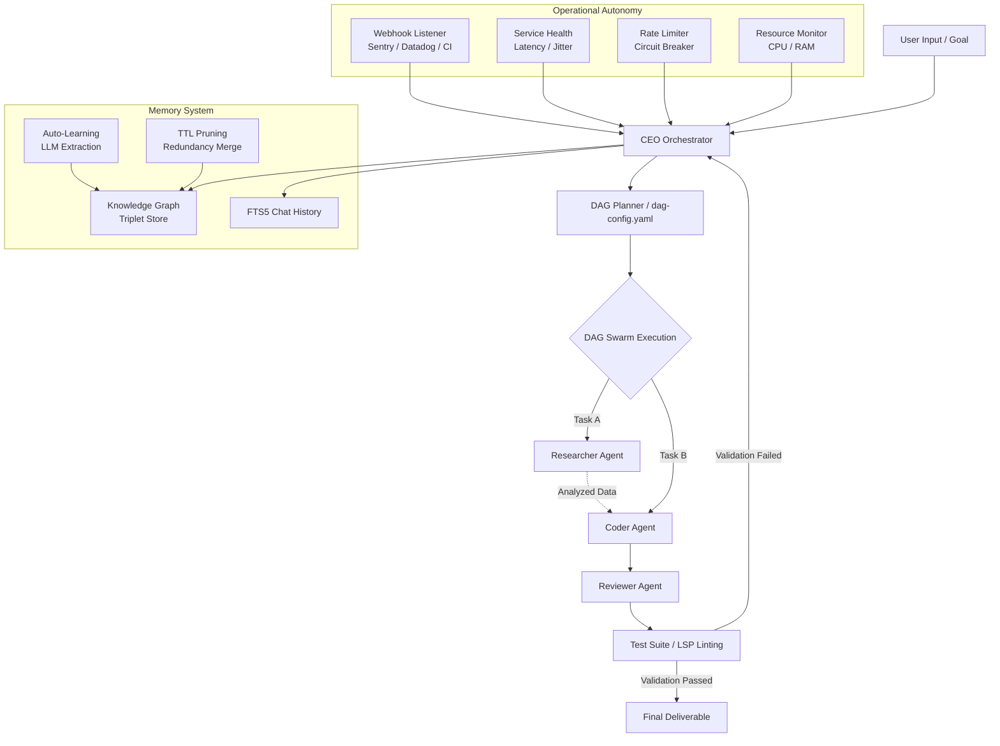

*HERMES meets PAPERCLIP — the coding agent that never forgets, never stops, and never asks twice.*  
*Knowledge graph memory · Deployment orchestration · Service health monitoring · Adaptive throttling · Web UI*


[](https://www.npmjs.com/package/custom-pi)
[](https://opensource.org/licenses/MIT)
[](https://nodejs.org)


---

## The Fusion

Hermes represents the swift, articulate messenger. The Paperclip Maximizer represents the theoretical model of absolute, relentless optimization toward a target goal.

custom-pi is a premium engineering extension suite for the Pi Coding Agent. It equips the host agent with persistent context recall, multi-agent wave orchestration, safe system execution tooling, and **full operational autonomy** — the ability to proactively monitor, react to external events, and manage the entire development lifecycle without continuous user intervention.

* **Knowledge Graph Memory**: SQLite-backed triplet store (Subject→Predicate→Object) with confidence scoring, TTL-based pruning, and automatic extraction from conversations and tool outputs.
* **Tiered Context Recall**: Intent classification decides whether to search FTS5 chat history, the knowledge graph, or system state — with cascading fallback.
* **DAG Swarms**: Multi-agent pipelines (Researcher, Coder, Reviewer) running in parallel to prevent single-agent execution dead-ends.
* **Deployment Orchestration**: Stateful CI/CD pipeline management — PR → build → tests → staging → smoke tests → production — with automatic rollback on failure.
* **Webhook Ingestion**: Receive events from Sentry, Datadog, GitHub, or custom CI. LLM-parsed into failure triplets with proactive triage when 3+ related errors occur.
* **Service Health Monitoring**: Periodic endpoint checks tracking latency, jitter, and consecutive failures. Contextual advisories modify planning based on service health.
* **Adaptive Throttling**: Rate limit tracking with exponential backoff circuit breaker. Resource-aware task scoring adjusts parallelism based on CPU/memory load.
* **35+ Built-in Tools**: Full-featured OS, browser, LSP, AST-grep, email, cryptographic vault, SSH, and social posting integration.
* **Dual Dashboards**: Stream reasoning and execution logs in real-time through an interactive fullscreen TUI or a React-based web dashboard.
* **Secure Sandbox**: Enforced user approval gates, AES-256 encrypted configuration storage, and isolated custom plugins execution.

---

## Interactive Architecture Flow

The workflow diagram below illustrates how custom-pi coordinates task completion through the CEO Orchestrator, the subagent swarm, and the diagnostic verification layer:



---

## Quick Start

### Installation

Install the package globally using npm:

```bash
npm install -g custom-pi
```

To run browser automation tasks, install Playwright's Chromium binary:

```bash
npx playwright install chromium
```

For full IDE code intelligence support, make sure you have appropriate language servers installed locally:

```bash
npm install -g typescript-language-server
pip install pyright
```

### Launch Commands

Start the terminal dashboard interface:

```bash
custom-pi
```

Start the React web server (served locally at http://localhost:4321):

```bash
custom-pi-web
```

---

## Technical Specifications

| Objective | Legacy Limitation | custom-pi Resolution |
| :--- | :--- | :--- |
| **Context Retention** | Agents lose state and forget decisions across sessions. | **Knowledge graph** (SQLite triplet store) with confidence scoring, weighted retrieval, and multi-hop graph traversal. |
| **Knowledge Synthesis** | Memory is manual; no automatic extraction from conversations. | **Auto-learning** LLM pipeline extracts Subject→Predicate→Object triplets from tool outputs and flushes them on a 5-min cron + shutdown. |
| **Memory Maintenance** | Stale or redundant facts accumulate and degrade retrieval quality. | **TTL-based pruning** per entity type (7d–5y) plus **redundancy merging** via similarity scoring; logged for manual review. |
| **Context Retrieval** | Single flat search — no strategy for different query types. | **Intent classification** (conversational / knowledge / system) drives **tiered recall**: FTS5 → triplets → state, with cascading fallback. |
| **Problem Solving** | Single agents get stuck in recursive bugs or loops. | **DAG swarms** that delegate specialized roles (Research, Coding, Reviewing) concurrently. |
| **Log Analysis** | Errors discovered only when the user reports them. | **Webhook ingestion** + LLM log parsing creates **failure triplets** and **incidents**; 3+ related failures trigger proactive triage. |
| **Deployment** | Manual CI/CD tracking with no agent oversight. | **Stateful pipeline orchestrator** tracks 6 stages (PR→build→tests→staging→smoke→prod) with auto-rollback on failure. |
| **Rate Limits** | API quota exhaustion causes silent failures. | **Circuit breaker** tracks `X-RateLimit-Remaining` headers; exponential backoff (`1s·2ⁿ`) defers calls until reset. |
| **Resource Awareness** | No visibility into host load when scheduling tasks. | **Host metrics** (`/proc/stat`, `/proc/meminfo`) feed a penalty scoring function that adjusts task parallelism dynamically. |
| **Service Health** | No awareness of external service degradation. | **Health monitor** pings endpoints, tracks latency/jitter, and injects contextual warnings into planning. |
| **Interface Telemetry** | Plain terminal scrolling output makes tracking swarms difficult. | **Double-buffered fullscreen TUI** alongside a WebSocket-driven React dashboard. |
| **Credentials Storage** | Storing API keys in plaintext files or config variables. | **AES-256-GCM encrypted vault** with programmatic key generation. |
| **Code Understanding** | Regex-based file search lacks structural and type context. | **LSP client integration** with ast-grep queries for 11+ languages. |
| **Web Access** | Incapable of logging in or interacting with complex JavaScript apps. | **Playwright integration** for screenshot capture, selector querying, and action execution. |

---

## Tool Arsenal (35+)

### Knowledge & Memory

* `memory_store` / `memory_search` / `memory_edit`: Create, retrieve, and update TF-IDF memory vectors.
* `/triplets`: Query the knowledge graph — list all triplets or drill into an entity's connections.
* `vault_set` / `vault_get` / `vault_delete` / `vault_list` / `vault_import`: Cryptographically secure storage mapped to AES-256-GCM encryption.

### Search and Web Automation

* `web_search`: Multi-tier search fallback chain (DuckDuckGo → Algolia HackerNews → Wikipedia).
* `web_fetch`: Programmatic page fetching with HTML-to-Markdown parsing and automatic user-agent rotation.
* `internal_url`: URL router handling internal schemas (`memory://`, `vault://`, `local://`, `issue://`, `pr://`, `skill://`, `rule://`).

### Headless Browser & Shell

* `browser`: Navigate, type, click, screenshot (base64 PNG), and extract node content via headless Chromium.
* `ssh_exec`: Execution of remote host commands with secure temporary SSH key and password management.

### Code Intelligence

* `lsp`: Programmatic interface for language servers supporting hover definitions, symbols, rename, and diagnostic arrays.
* `ast_grep`: Structural syntax tree search across 11 programming languages.
* `hashline_edit`: Content-hash validated code editing to ensure merge safety and prevent corrupt patches.

### Integrations and Messaging

* `github`: Full integration with the GitHub API for issues, pull request tracking, and branch-specific code search.
* `send_email`: Compose and dispatch emails using the Gmail API via OAuth 2.0 Device Flow authorization.

### Broadcast & Social API

* `post_to_reddit`: Submit post payloads via Reddit OAuth password grant.
* `post_to_bluesky`: AT Protocol client helper for publishing text updates.
* `post_to_discord`: Webhook integration for system logs broadcasting.
* `post_to_telegram`: Bot API integration for secure command updates.

### Media Synthesis

* `generate_image`: Automated image rendering using DALL-E 3, Gemini, or Grok based on active vault credentials.
* `text_to_speech`: Edge-tts CLI client returning audio base64 buffers.
* `render_mermaid`: Compiles Mermaid diagrams into SVG vectors with ASCII fallbacks.

### Orchestration & State

* `plan`: Formulate, track, and complete multi-step checklists.
* `session`: Checkpoint serialization containing execution states, tools, and variables.
* `plugin`: Register, configure, and isolate dynamic JavaScript extensions.
* `todo_write`: Structured task lists with phased action plans.

---

## Multi-Agent Swarms

Configure parallel multi-agent workflows using `~/.pi/agent/dag-config.yaml`:

```yaml
version: 1
mode: pipeline
pipeline_count: 3
agents:
  - id: researcher
    role: Research specifications and codebase structure
    tools: [web_search, web_fetch, memory_search]
    waits_for: []
  - id: coder
    role: Implement software features and bug fixes
    tools: [write, edit, bash, glob, grep]
    waits_for: [researcher]
  - id: reviewer
    role: Validate type checks, tests, and run compiler
    tools: [bash, glob, grep, lsp]
    waits_for: [coder]
```

### Swarm Execution Configurations

* **pipeline**: Iterative loop. Reviewer validates output, and the CEO Orchestrator routes feedback to the Coder/Researcher if defects are found.
* **parallel**: Executes all agents concurrently when task definitions do not overlap.
* **sequential**: Strict single-lane dependency execution.

---

## Operational Autonomy Features

### Webhook Ingestion & Anomaly Detection

custom-pi runs a webhook listener at `POST /api/webhooks/:source` that accepts events from Sentry, Datadog, GitHub Actions, or any custom CI. Each event is:

1. **Normalized** into a standard format by `listener.js`.
2. **Parsed by an LLM** to extract structured failure data: component, error code, severity.
3. **Persisted as a failure triplet** in the knowledge graph, tagged with severity.
4. **Aggregated into incidents** — if 3+ related failures occur in a short window, a triage task is automatically raised.

### Service Health Monitoring

The `service-health-monitor` periodically checks external endpoints, tracking:
- **Latency** (ms) and **jitter** (variance between checks)
- **Consecutive failures** for flapping detection
- **Status classification**: excellent (<50ms), good, degraded, slow, critical (>2s)

Health data feeds into the planner: *"PostgreSQL pool latency is 150ms — prioritizing reads over writes for 2 hours."*

### Deployment Pipeline

The `deployment-orchestrator` manages stateful pipelines:
1. PR Created → Build Started → Unit Tests → Staging Deploy → Smoke Tests → Production Deploy
2. Each stage runs verification gates (idempotent bash scripts checking critical invariants).
3. On failure, the orchestrator auto-rolls back to the last stable commit SHA.

### Rate Limit Management

All tool-calling wrappers use a **circuit breaker pattern**:
- Tracks `X-RateLimit-Remaining` from API responses.
- When remaining < 5, flips a `RATE_LIMIT_BREACH` flag and applies **exponential backoff** (delay = `1s × 2ⁿ`, capped at 60s).
- Subsequent tool calls wait for the delay or defer to a lower-priority queue.

### Resource-Aware Scheduling

The `resource-monitor` reads `/proc/stat` and `/proc/meminfo` every check cycle:
- **CPU usage %** and **memory usage %**
- **Load average** compared to CPU core count
- Task priority is penalized: `Score = Importance / (Resources × Cost)` — at 90% CPU, parallel subagent cost skyrockets, favoring sequential execution.

---

## Memory System

### Knowledge Graph (Triplet Store)

custom-pi maintains a SQLite knowledge graph with the schema `(Subject) → [Predicate] → (Object)`, each triplet having:
- **Confidence score** (0.0–1.0) — how reliable the fact is
- **Entity types**: tool, file, function, class, concept, dependency, setting, person
- **TTL by type**: tool data (7d), files (90d), functions/classes (180d), concepts/dependencies (365d), people (5y)

**Commands:**
```
/triplets            — List top 20 knowledge graph entries
/triplets <entity>   — Drill into an entity's connections
```

### TF-IDF Semantic Memory

Legacy vector memory using cosine similarity with recency decay:

$$\text{Retrieved Weight} = \text{Cosine Similarity}(Q, M_i) \times e^{-\lambda t}$$

### Auto-Learning

Every significant tool output is queued for LLM-based triplet extraction. The `triplet-generator`:
1. Feeds raw text to an LLM with a structured extraction prompt.
2. Validates the JSON output against the TripletRecord schema.
3. Deduplicates and upserts into the knowledge graph (min confidence: 0.4).

### Memory Pruning

A daily cron job runs:
- **Staleness pruning**: Deletes triplets past their TTL.
- **Redundancy merging**: Finds near-duplicate triplets (same subject/object, similar predicate), keeps the highest confidence entry.
- **Prune logging**: All actions are logged to `prune-log.json` for manual review.

---

## Web Dashboard

The React dashboard provides real-time visibility into all subsystems:

| Tab | View |
|:---|:---|
| **Chat** | Real-time conversation with streaming agent output |
| **Dashboard** | System telemetry, budget, vault, MCP servers, work products |
| **Memory** | TF-IDF semantic memory search and storage |
| **Knowledge Graph** | Triplet table with confidence slider, entity drill-down |
| **Pipeline** | Deployment pipeline status across all stages |
| **Health** | Service health, host CPU/RAM, rate limit status |
| **Sub-Agents** | Swarm agent logs, tool calls, status |
| **Secrets Vault** | Encrypted credential management |
| **Budget** | Token/cost tracking with daily and per-session limits |

---

## Runtime File Structure

All assets, extensions, and configurations are synchronized locally in your home directory:

```
~/.pi/agent/
├── SOUL.md                 # Identity definition injected on turn start
├── SYSTEM.md               # Core programming and formatting rules
├── settings.json           # Model profiles and active configurations
├── models.json             # API keys and provider targets
├── session-state.db        # SQLite database (messages, triplets, health, rate limits)
├── session-state.json      # Periodic state snapshots (every 10 turns)
├── dag-config.yaml         # Active swarm configurations
├── mcp-servers.json        # MCP server definition list
├── lsp-servers.json        # LSP server executables mapping
├── prune-log.json          # Triplet pruning audit log
├── checkpoints/            # Directory containing past session snapshots
├── costs/                  # Log files tracking token usage and cost bounds
├── work-products/          # Ledger mapping created and modified files
├── webhooks/               # Incoming webhook event storage
├── plugins/                # Directory containing dynamic script extensions
├── .vault/                 # Secure storage directory
│   ├── master.key          # 32-byte hex master key
│   └── vault.json          # Encrypted key-value database
└── web/                    # Distribution containing Vite client assets
```

---

## Testing & Verification

Verify the system by running the full unit and integration test suites:

```bash
npm test
```

Check TypeScript type compiler compliance:

```bash
npx tsc --noEmit
```

---

## License

MIT - Licensed under the MIT License. Free to use, modify, and distribute.

---

**Hermes speed + Paperclip obsession = custom-pi**  
*One agent to configure them all. And in the terminal bind them.*
