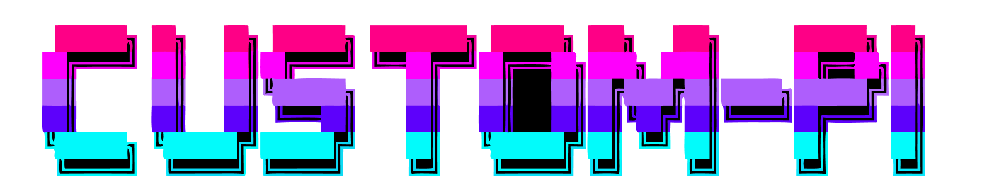
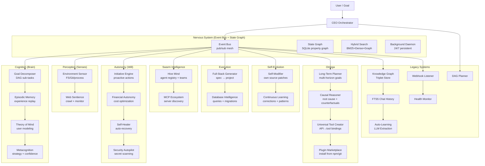

*HERMES meets PAPERCLIP — the coding agent that never forgets, never stops, and never asks twice.*  
*Knowledge graph memory · Free AI image generation · Social media automation · DAG swarms · Web dashboard · Autonomous cognition · Self-evolving AGI*



[](https://www.npmjs.com/package/custom-pi)
[](https://opensource.org/licenses/MIT)
[](https://nodejs.org)


> 🌐 **Landing Page**: [custom-pi-ai.vercel.app](https://custom-pi-ai.vercel.app/) — Interactive product showcase with live demo, voice synthesis preview, and documentation

---

## What's New — v1.9.1

### Image Gallery — Preview, Upload & Delete
- **Image preview** — Click any gallery image to see a full-size preview with loading states
- **Delete with confirmation** — Red confirm dialog prevents accidental deletions
- **Upload validation** — 10MB max file size, visual feedback during upload
- **Error handling** — Toast notifications for upload/preview/delete failures

### Canvas Editor — Full Drawing Suite
- **8 drawing tools**: Pen, Line, Arrow, Rect, Circle, Text, Eraser, Crop
- **Fill mode** — Fill shapes with the selected color
- **15-color palette + custom color picker** — Eyedropper-style selection
- **Brush size slider** — 1–40px with live preview
- **7 filters**: Grayscale, Sepia, Invert, Blur
- **Undo/Redo** — 50-state history with keyboard shortcuts (Ctrl+Z / Ctrl+Shift+Z)
- **Zoom & Pan** — 10–500% zoom slider, Fit/1:1 buttons, Space+drag to pan
- **Rotate & Flip** — 90° CW/CCW, horizontal/vertical flip
- **Canvas resize** — Modal dialog with custom width/height
- **Aspect-ratio crop** — Free, 1:1, 4:3, 16:9, 3:2 with rule-of-thirds overlay
- **Export** — PNG, JPEG, WebP with quality settings
- **Text tool** — Font size selection (12–72px), position on click
- **Gallery integration** — Load images directly from gallery
- **Keyboard shortcuts** — Tool hotkeys (P/L/A/R/C/T/E/V/F), zoom (+/-/0), undo/redo

### Document Editor — AI-Powered Writing
- **AI Document Generation** — Type a topic ("teach me javascript") and get a full Markdown document with headings, code blocks, tables, and lists
- **AI Document Editing** — "rewrite this in simpler language" or "add a section about error handling"
- **Rich Markdown Preview** — Live split-pane preview with syntax highlighting for JS/TS, Python, JSON, HTML, CSS, Bash
- **Multi-tab editing** — Create, rename, close documents with dirty-state indicators
- **Document Library** — Save/load/delete documents (persisted in localStorage)
- **Export** — Download documents as `.md` files
- **Loading animations** — Pulse dots + shimmer bar during AI generation
- **Error handling** — Inline error messages with timeout diagnostics
- **Keyboard shortcuts** — Ctrl+Enter to apply AI edit, Escape to close

### Bug Fixes
- **Dashboard crash** — Fixed `c.slice is not a function` error when models API returns an object instead of array
- **LLM Chat completions** — New `/api/chat/completions` endpoint proxies to local LM Studio / Ollama with proper auth, 10-min timeout, and diagnostic error messages

---

## The Fusion

**Generate stunning visuals for social media posts at zero cost — no API keys, no subscriptions, no hidden fees.**

custom-pi now includes a complete **free image generation pipeline** powered by [Pollinations.ai](https://pollinations.ai). The agent can generate, select, and attach images to social media posts entirely for free.

```mermaid
graph LR
  A[Agent prompts<br/>generate_image] --> B[Pollinations.ai<br/>4 images · free]
  B --> C[Saved to<br/>~/.pi/assets/]
  C --> D[AssetSelector modal<br/>shows 4 images]
  D --> E[User picks one]
  E --> F[Others auto-deleted]
  F --> G[Image attached<br/>to social post]
  
  style A fill:#1a1a2e,stroke:#00d7ff
  style B fill:#1a1a2e,stroke:#00ff88
  style D fill:#1a1a2e,stroke:#ff6b6b
  style G fill:#1a1a2e,stroke:#af00ff
```



### Features

| Feature | Description |
|:---|:---|
| ** Free Generation** | Generate images via Pollinations.ai — Flux, GPT Image, Seedream models. Zero cost, unlimited use. |
| ** No API Keys** | Defaults to free provider. No signup, no credit card, no configuration. |
| ** Batch Generation** | Creates 4 images by default with different seeds — more variety, better picks. |
| ** Visual Selection** | AssetSelector modal shows all generated images in a grid — click to pick, rest auto-deleted. |
| ** Asset Gallery** | All generated images saved to `~/.pi/assets/` with preview, copy-path, and delete controls. |
| ** Post Integration** | Selected image attaches directly to social media posts in the approval preview. |
| **⚡ Premium Option** | Set `provider: "designapi"` with a `DESIGN_API_KEY` for Flux Pro, DALL-E 3, Recraft, Ideogram. |

---

## The Fusion

Hermes represents the swift, articulate messenger. The Paperclip Maximizer represents the theoretical model of absolute, relentless optimization toward a target goal.

custom-pi is a premium engineering extension suite for the Pi Coding Agent. It equips the host agent with persistent context recall, multi-agent wave orchestration, safe system execution tooling, **full operational autonomy**, and **zero-cost media generation** — the ability to proactively research, write, generate visuals for, and publish social media content without continuous user intervention.

* **Free AI Image Generation**: Built-in Pollinations.ai integration. Generate 4 images, pick the best, attach to posts — all free.
* **Social Media Automation**: Post to Twitter/X, Reddit, Bluesky, Discord, Telegram — full browser automation with persistent login.
* **Asset Pipeline**: Generate → Select → Attach → Publish. Complete visual content workflow.
* **Knowledge Graph Memory**: SQLite-backed triplet store (Subject→Predicate→Object) with confidence scoring, TTL-based pruning, and automatic extraction.
* **Tiered Context Recall**: Intent classification drives FTS5 chat history, knowledge graph, or system state queries with cascading fallback.
* **DAG Swarms**: Multi-agent pipelines (Researcher, Writer, Publisher) running in parallel — no single-agent dead-ends.
* **Deployment Orchestration**: Stateful CI/CD pipeline — PR → build → tests → staging → smoke tests → production — with auto-rollback.
* **Webhook Ingestion**: Receive events from Sentry, Datadog, GitHub. LLM-parsed failure triplets with proactive triage.
* **Service Health Monitoring**: Periodic endpoint checks — latency, jitter, consecutive failures. Contextual advisories adjust planning.
* **Adaptive Throttling**: Circuit breaker with exponential backoff. Resource-aware task scoring adjusts parallelism.
* **40+ Built-in Tools**: OS, browser, LSP, AST-grep, email, cryptographic vault, SSH, social posting, image generation.
* **Dual Dashboards**: Fullscreen TUI + real-time React web dashboard.
* **Secure Sandbox**: Enforced approval gates, AES-256 encrypted vault, isolated plugin execution.

---

##  Quick Start

### Installation

```bash
npm install -g custom-pi
```

For browser automation (social posting, image automation):

```bash
npx playwright install chromium
```

For IDE code intelligence:

```bash
npm install -g typescript-language-server
pip install pyright
```

### Launch

```bash
custom-pi          # Terminal dashboard
custom-pi-web      # Web dashboard at http://localhost:4321
```

---

## Free Image Generation — In Action

### Agent Workflow

The `generate_image` tool defaults to Pollinations.ai — no API key needed:

```
Agent: generate_image(provider: "free", prompt: "futuristic cityscape cyberpunk", count: 4)
  → 4 images generated, saved to ~/.pi/assets/
  → "Call request_asset_selection with filenames: [...]"

Agent: request_asset_selection(filenames: [...], prompt: "futuristic cityscape")
  → AssetSelector modal opens in web UI
  → User clicks preferred image
  → Others auto-deleted
  → "Selected: asset_171234_2.png"

Agent: request_post_approval(platform: "twitter", content: "...", assetUrl: "asset_171234_2.png")
  → PostApproval shows tweet + image side by side
  → User approves
  → Published to Twitter/X
```

### Manual Use

Any agent or chat can generate images on demand:

```
"generate an image of a robot cooking breakfast and save it"
```

### Premium Models

Set `provider: "designapi"` and add a `DESIGN_API_KEY` to your vault for access to Flux Pro, DALL-E 3, Recraft v3, and Ideogram.

---

## Social Media Automation

custom-pi automates the entire social media workflow — research, draft, generate visuals, approve, publish.

### Connected Platforms

| Platform | Authentication | Capabilities |
|:---|:---|:---|
| **Twitter / X** | Browser login | Post tweets with images, threads |
| **Reddit** | Browser login | Submit posts with titles, subreddit targeting |
| **Bluesky** | Browser login | Publish text updates |
| **Discord** | Bot token / Webhook | Channel messages, embeds |
| **Telegram** | Bot token | Channel posts, media |

### Swarm Commander

The **Social Media Manager** swarm handles the full pipeline:

1. **Researcher** — Finds trending topics, news, and content ideas using web search
2. **Writer** — Drafts platform-optimized posts AND generates matching visuals
3. **Publisher** — Shows previews for approval, publishes to connected platforms

---

## Interactive Architecture Flow



---

## Ascension Engine

custom-pi has evolved from a reactive coding assistant into a **proactive, self-aware, self-evolving AI system** with 26+ interconnected subsystems organized in 9 phases. All subsystems communicate through a quantum event bus and persist state in a unified property graph database.

### Phase 0 — Foundation (Nervous System)

| Subsystem | Description |
|:---|:---|
| **Event Bus** | Typed publish/subscribe mesh with 70+ event topics, filtering, history replay, middleware, and correlation IDs. Every subsystem communicates through events — no direct coupling. |
| **State Graph** | SQLite-backed property graph with FTS5 indexing, recursive CTE path-finding, neighbor traversal, TTL-based pruning, and typed nodes/edges. Single store for all state. |
| **Hybrid Search** | Four-strategy fusion: BM25 (sparse keyword), Dense cosine (semantic), Graph traversal (relational), Cross-encoder reranking (precision). Adaptive strategy selection per query. |
| **Background Daemon** | 24/7 persistent background process with idle detection, scheduled tasks, state persistence, heartbeat monitoring, and a CLI (`daemon.js start\|stop\|status`). |

### Phase 1 — Cognition (Brain)

| Subsystem | Description |
|:---|:---|
| **Goal Decomposer** | LLM-powered goal decomposition into DAGs of sub-tasks with dependency resolution, priority scoring, token estimation, and adaptive re-planning on failure. |
| **Episodic Memory** | Stores sessions, failures, and successes as episodes with emotional valence (success/failure signals). Auto-compression, experience replay, and **dream consolidation** (offline replay during idle, like human sleep). |
| **Theory of Mind** | Maintains a dynamic user model: expertise level, emotional state, communication style, preferences, and trust calibration. Adapts verbosity, technical depth, and autonomy based on user state. |
| **Metacognition** | Thinks about its own thinking: strategy selection (CoT, ToT, ReAct, Reflexion), confidence assessment, knowledge gap identification, and self-critique loops. |

### Phase 2 — Perception (Senses)

| Subsystem | Description |
|:---|:---|
| **Environment Sensor** | Monitors file system (recursive watchers), git state (branch, dirty files, CI), running processes, disk usage, memory pressure, network status, and system hardware. |
| **Web Sentience** | Continuous web monitoring: trend detection, GitHub trending tracker, npm package discovery, personalized news aggregation, and deep research capability with scheduled crawling. |

### Phase 3 — Autonomy (Will)

| Subsystem | Description |
|:---|:---|
| **Initiative Engine** | Proactive opportunity detection with priority scoring (`Impact × Urgency × Confidence × UserReceptivity`). Curiosity-driven exploration, preventive maintenance, scheduled autonomy, and user receptivity tracking. |
| **Financial Autonomy** | Token cost tracking per-provider, configurable budget alerts, optimal model selection (cheapest adequate model per task), cumulative spending dashboards, and cost forecasting. |
| **Self-Healer** | Health checks on SQLite, disk, memory, and network. Circuit breaker with automatic recovery, failure count tracking, severity escalation, and auto-heal after 3+ consecutive failures. |
| **Security Autopilot** | Scans files for secrets (AWS keys, GitHub tokens, private keys, JWT, connection strings, etc.) with severity scoring. Scheduled background audits, vault integrity checks, and security score calculation. |

### Phase 4 — Swarm Intelligence (Collective)

| Subsystem | Description |
|:---|:---|
| **Hive Mind** | Agent registry with dynamic team formation based on task requirements, consensus voting for critical decisions, and shared knowledge broadcasting across all agents. |
| **MCP Ecosystem** | MCP server lifecycle management (install/start/stop/remove), tool/resource discovery, auto-discovery from npm/GitHub, and capability composition across servers. |

### Phase 5 — Execution (Muscles)

| Subsystem | Description |
|:---|:---|
| **Full-Stack Generator** | Generates complete projects from a spec: config files, database schema + migrations, JWT auth, REST API with Express/Fastify, React frontend, Docker setup, CI pipeline, and README. |
| **Database Intelligence** | SQLite analyzer (schema, table stats, index usage), index suggestions, query EXPLAIN analysis, migration manager with rollback, and automated backup with gzip compression. |

### Phase 6 — Self-Evolution (Metamorphosis)

| Subsystem | Description |
|:---|:---|
| **Self-Modifier** | Proposes and applies patches to its own source code. Generates diffs, creates backups before modification, allows rollback, and validates changes with type-check testing. |
| **Continuous Learning** | Learns from user corrections, tool call outcomes (success/failure patterns), and feedback. Extracts patterns from repeated behaviors, consolidates knowledge weekly, and adjusts behavior based on correction rate. |

### Phase 7 — Omega (Advanced Cognition)

| Subsystem | Description |
|:---|:---|
| **Long-Term Planner** | Multi-horizon goal planning (days/months/years), milestone tracking with status, risk forecasting, roadmap generation, and strategic advice delivery. |
| **Causal Reasoner** | Causal link inference from event sequences, root cause analysis with path tracing, counterfactual evaluation ("what if we used X instead of Y?"), and causal pathfinding through the state graph. |
| **Universal Tool Creator** | Generates tool bindings from API specs (OpenAPI) or README documentation. Persists custom tools to the tool registry, supports dynamic loading at runtime, and validates tool calls against generated schemas. |

### Phase 8 — Transcendence

| Subsystem | Description |
|:---|:---|
| **Plugin Marketplace** | Install plugins from npm, GitHub, or local paths. Hook system for lifecycle events (before/after tool calls, message processing). Sandboxed execution with resource limits. Registry with versioning and metadata. |

---

## Tool Arsenal (40+)

### Media Synthesis

* `generate_image` — **Free image generation** via Pollinations.ai (default, no key needed) or premium DesignAPI/OpenAI/Gemini/Grok. Generates 4 images, saves to asset gallery.
* `request_asset_selection` — Shows generated images in a selection modal. User picks one, rest auto-deleted.
* `text_to_speech` — Edge-tts CLI returning audio buffers. Web UI also includes a full Voice Agent panel with STT (speech-to-text) and TTS (text-to-speech) via Kokoro TTS server, with voice selection (male/female presets), audio test tone, and a 3D animated particle globe avatar that reacts to speaking.
* `render_mermaid` — Compiles Mermaid diagrams to SVG with ASCII fallback.

### Social & Broadcast

* `request_post_approval` — Shows formatted post preview with attached image. User Approves, Edits, or Skips.
* `post_to_twitter` — Tweet with optional image attachment.
* `post_to_reddit` — Submit posts with title and subreddit targeting.
* `post_to_bluesky` / `post_to_discord` / `post_to_telegram` — Platform-specific publishing.

### Knowledge & Memory

* `memory_store` / `memory_search` / `memory_edit`: TF-IDF vector memory with recency decay.
* `/triplets`: Knowledge graph queries — list triplets, drill into entities.
* `vault_set` / `vault_get` / `vault_delete` / `vault_list` / `vault_import`: AES-256-GCM encrypted credential storage.

### Search & Web

* `web_search`: Multi-tier search (DuckDuckGo → Algolia → Wikipedia).
* `web_fetch`: Page fetching with HTML-to-Markdown and user-agent rotation.
* `internal_url`: Internal schema router (`memory://`, `vault://`, `local://`, etc.).

### Browser & Shell

* `browser`: Headless Chromium — navigate, type, click, screenshot, extract.
* `ssh_exec`: Remote command execution with secure key management.

### Code Intelligence

* `lsp`: Language server protocol — hover, symbols, rename, diagnostics.
* `ast_grep`: Structural syntax search across 11 languages.
* `hashline_edit`: Content-hash validated safe editing.

### Integrations

* `github`: Full GitHub API — issues, PRs, code search.
* `send_email`: Gmail via OAuth 2.0 Device Flow.
* `plugin`: Dynamic JavaScript extension system.

### Ascension (Autonomous)

* `initialize_ascension` — Boot all 26+ subsystems: event bus, state graph, daemon, cognition, perception, autonomy, swarm, execution, evolution, omega.
* `shutdown_ascension` — Gracefully stop all subsystems, persist state, close graph database.
* `daemon start|stop|status` — Background daemon lifecycle management.

### Orchestration

* `plan`: Multi-step checklist creation and tracking.
* `session`: State checkpoint serialization.
* `todo_write`: Structured task lists.
* `decompose_goal` — Break a high-level goal into DAG of sub-tasks with dependency resolution.
* `long_term_plan` — Generate multi-horizon roadmap with milestones and risk forecasts.
* `causal_analyze` — Root cause analysis and counterfactual evaluation via causal graph.
* `create_tool` — Generate a tool binding from an API spec or README documentation.

---

## Multi-Agent Swarms

### Hive Mind (Dynamic Teams)

Beyond static DAG configs, the **Hive Mind** forms teams on-the-fly based on task requirements:

```
Goal: "Deploy a full-stack app with monitoring"
→ Team formed: [architect, backend-dev, frontend-dev, devops, security-reviewer]
→ Communication: shared event bus + state graph
→ Decision model: consensus for critical choices
```

All agents share the same episodic memory — when one learns, all benefit. Teams negotiate task handoff, share knowledge through the event bus, and vote on critical decisions.

### DAG Swarms (Pipeline Mode)

Configure parallel workflows with `~/.pi/agent/dag-config.yaml`:

```yaml
version: 1
mode: pipeline
pipeline_count: 3
agents:
  - id: researcher
    role: Research specifications and codebase structure
    tools: [web_search, web_fetch, memory_search]
    waits_for: []
  - id: coder
    role: Implement features and fix bugs
    tools: [write, edit, bash, glob, grep]
    waits_for: [researcher]
  - id: reviewer
    role: Validate type checks, tests, compiler
    tools: [bash, glob, grep, lsp]
    waits_for: [coder]
```

### Execution Modes

| Mode | Behavior |
|:---|:---|
| **pipeline** | Iterative loop — reviewer validates, CEO routes feedback |
| **parallel** | All agents concurrent when tasks don't overlap |
| **sequential** | Strict single-lane dependency chain |

### Default Swarm: Social Media Manager

custom-pi ships with a pre-configured **Social Media Manager** team:

| Agent | Role | Tools |
|:---|:---|:---|
| **Researcher** | Finds trending topics and content ideas | `web_search`, `web_fetch`, `write` |
| **Writer** | Drafts posts + generates visuals | `write`, `edit`, `read`, `generate_image`, `request_asset_selection` |
| **Publisher** | Shows previews, publishes | `post_to_twitter`, `post_to_reddit`, `post_to_bluesky`, `post_to_discord`, `post_to_telegram`, `request_post_approval` |

---

## 🌐 Web Dashboard

The React dashboard provides real-time control over all features:

| Tab | What you can do |
|:---|:---|
| **Swarm Commander** | Launch teams, view agent logs, select generated assets, approve posts |
| **Image Gallery** | Upload images, preview with lightbox, delete with confirmation, file size validation |
| **Canvas Editor** | Full drawing suite: pen, line, arrow, rect, circle, text, eraser, crop. Filters, undo/redo, zoom/pan, rotate/flip, resize, export PNG/JPEG/WebP |
| **Documents** | Multi-tab Markdown editor with AI generation & editing, live preview with syntax highlighting, document library |
| **Chat** | Real-time streaming agent output |
| **Dashboard** | System telemetry, budget, vault, MCP servers |
| **Memory** | TF-IDF semantic search and storage |
| **Knowledge Graph** | Triplet table with confidence slider, entity drill-down |
| **Pipeline** | Deployment stages status |
| **Health** | Service health, CPU/RAM, rate limits |
| **Social Accounts** | Connect/disconnect Twitter, Reddit, Bluesky, Discord, Telegram |
| **Secrets Vault** | Encrypted credential management |
| **Budget** | Token/cost tracking |
| **Voice Agent** | Real-time voice chat with STT transcription and TTS playback. 3D particle globe avatar animates to speech and responds to hover. Multiple voice presets (male/female). Test tone and volume control. |

---

## Operational Autonomy

### Proactive Initiative Engine

No longer waits for commands. Scans for opportunities continuously:
- **Curiosity-driven exploration** — explores the codebase during idle time, learns new patterns
- **Opportunity detection** — "I noticed your test coverage dropped. Want me to write tests?"
- **Preventive maintenance** — "Your disk is at 85%. I'll archive old sessions."
- **Scheduled autonomy** — "Every Monday, generate the weekly report and email it."

Scored as: `Initiative_Score = Impact × Urgency × Confidence × UserReceptivity`

### Self-Healing System

Regular health checks on all subsystems (SQLite, disk, memory, network). Circuit breaker with automatic recovery — if a component fails 3+ times consecutively, auto-heal is triggered. Failed checks are logged with severity escalation.

### Security Autopilot

Background file scanning for secret patterns (AWS keys, GitHub tokens, private keys, JWT, connection strings, etc.) with severity ratings (critical/high/medium/low). Computes a security score and alerts on critical findings.

### Webhook Ingestion & Anomaly Detection

Runs a webhook listener at `POST /api/webhooks/:source` accepting events from Sentry, Datadog, GitHub Actions. Each event is normalized → LLM-parsed → persisted as a failure triplet → aggregated into incidents. 3+ related failures trigger automatic triage.

### Service Health Monitoring

Periodic external endpoint checks tracking latency, jitter, consecutive failures. Status classifications from excellent (<50ms) to critical (>2s) feed contextual planning advisories.

### Rate Limit Management

Circuit breaker pattern tracking `X-RateLimit-Remaining` headers. Below threshold flips `RATE_LIMIT_BREACH` flag with exponential backoff (`1s × 2ⁿ`, capped at 60s).

### Resource-Aware Scheduling

Reads `/proc/stat` and `/proc/meminfo` every check cycle. Task priority scored as `Score = Importance / (Resources × Cost)`. At 90% CPU, parallel execution cost skyrockets — favors sequential.

### Financial Autonomy

Tracks token costs per-provider (OpenAI, Anthropic, Google, Ollama, LM Studio). Routes tasks to the cheapest adequate model automatically. Budget alerts when approaching limits. Cumulative spending dashboard with per-session breakdowns.

---

## Memory System

custom-pi has three memory tiers, each optimized for different recall patterns:

### Tier 1: Episodic Memory (Experience)

Stores entire sessions, failures, and successes as **episodes** with emotional valence. Features auto-compression (old episodes summarized into gist memories), experience replay (past episodes retrieved when facing similar situations), and **dream consolidation** — offline replay during idle time (like human sleep).

### Tier 2: Hybrid Search (Knowledge)

Four-strategy fusion engine:

| Strategy | Type | Use Case |
|:---|:---|:---|
| **BM25** | Sparse (keyword) | Exact matching, code symbols, identifiers |
| **Dense Cosine** | Dense (semantic) | Conceptual similarity, paraphrased queries |
| **Graph Traversal** | Relational | "What connects to X?", path finding |
| **Cross-encoder** | Precision reranking | Final relevance sorting |

Strategy selection adapts per query — code queries favor BM25, conceptual queries favor dense search.

### Tier 3: Knowledge Graph (Triplet Store)

SQLite-backed: `(Subject) → [Predicate] → (Object)`. Each triplet has confidence score (0.0–1.0), entity type (tool, file, function, class, concept, dependency, setting, person), and TTL (7d–5y).

```
/triplets            — List top 20 entries
/triplets <entity>   — Drill into connections
```

### Auto-Learning

Every significant tool output is LLM-parsed for triplet extraction. Validated against TripletRecord schema, deduplicated, upserted into knowledge graph (min confidence: 0.4). Additionally, the **Continuous Learning** subsystem learns from user corrections and tool call outcomes, extracting behavioral patterns with confidence scoring.

### Memory Pruning

Daily cron: TTL-based staleness deletion + redundancy merging (near-duplicate triplets keep highest confidence). All actions logged to `prune-log.json`. Episode compression runs during idle cycles.

---

## Runtime File Structure

```
~/.pi/agent/
├── SOUL.md                         # Identity definition
├── SYSTEM.md                       # Core programming rules
├── settings.json                   # Model profiles
├── models.json                     # API keys and providers
├── session-state.db                # SQLite (messages, triplets, health, rate limits)
├── state-graph.db                  # Property graph database (Phase 0)
├── dag-config.yaml                 # Swarm configurations
├── mcp-servers.json                # MCP server definitions
├── lsp-servers.json                # LSP server mappings
├── assets/                         # Generated images
│   ├── asset_171234_0.png
│   ├── asset_171234_1.png
│   └── asset_171234_2.png
├── .vault/
│   ├── master.key                  # 32-byte hex key
│   └── vault.json                  # Encrypted key-value store
├── extensions/subagents/src/       # Ascension engine modules
│   ├── event-bus/                  # Phase 0 — typed pub/sub mesh
│   ├── state-graph/                # Phase 0 — property graph
│   ├── daemon/                     # Phase 0 — background daemon
│   ├── cognition/                  # Phase 1 — goal decomposer, episodic memory, ToM, metacognition
│   ├── perception/                 # Phase 2 — environment sensor, web sentience
│   ├── autonomy/                   # Phase 3 — initiative, financial, self-healer, security
│   ├── swarm/                      # Phase 4 — hive mind, MCP ecosystem
│   ├── execution/                  # Phase 5 — full-stack generator, database intelligence
│   ├── evolution/                  # Phase 6 — self-modifier, continuous learning
│   ├── omega/                      # Phase 7 — long-term planner, causal reasoner, tool creator
│   ├── plugin-system/              # Phase 8 — plugin marketplace
│   └── ascension-bootstrap.ts      # Integration wiring for all subsystems
├── plugins/                        # Dynamic script extensions + marketplace installs
├── checkpoints/                    # Session snapshots
├── costs/                          # Token usage logs
├── work-products/                  # Created/modified files ledger
├── webhooks/                       # Incoming event storage
└── web/                            # Vite client distribution
```

---

## Testing

```bash
npm test                 # Unit + integration tests
npx tsc --noEmit         # TypeScript compliance
```

---

## License

MIT — Free to use, modify, and distribute.

---

## Contributing

1. Fork the repo, create a feature branch from `main`.
2. Ensure all tests pass: `npm test && npx tsc --noEmit`.
3. Open a PR with a clear title and description.
4. At least 1 review approval required. No direct pushes to `main`.

### Reporting Issues

[github.com/IamNishant51/Custom-PI/issues](https://github.com/IamNishant51/Custom-PI/issues)

---

**Hermes speed + Paperclip obsession = custom-pi**  
*Free images. Social automation. One agent to bind them all.*
