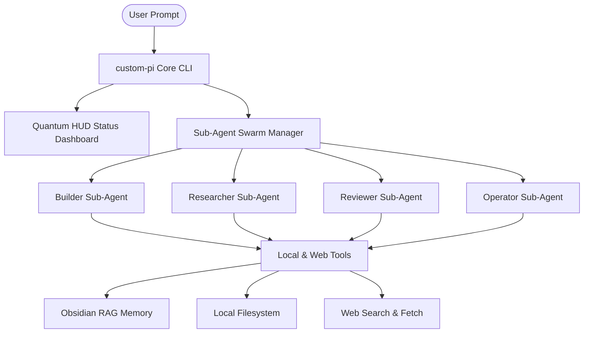

# custom-pi

<pre align="center" style="font-family: monospace; line-height: 1.2;">
<span style="color: #ff007f;">  ██████╗ ██╗   ██╗ ██████╗ ████████╗ ██████╗ ███╗   ███╗      ██████╗ ██╗</span>
<span style="color: #ff66ff;"> ██╔════╝ ██║   ██║██╔════╝ ╚══██╔══╝██╔═══██╗████╗ ████║      ██╔══██╗██║</span>
<span style="color: #a122ff;"> ██║      ██║   ██║╚██████╗    ██║   ██║   ██║██╔████╔██║█████╗██████╔╝██║</span>
<span style="color: #8855ff;"> ██║      ██║   ██║ ╚═══██║    ██║   ██║   ██║██║╚██╔╝██║╚════╝██╔═══╝ ██║</span>
<span style="color: #00f0ff;"> ╚██████╗ ╚██████╔╝██████╔╝    ██║   ╚██████╔╝██║ ╚═╝ ██║      ██║     ██║</span>
<span style="color: #00ffcc;">  ╚═════╝  ╚═════╝ ╚═════╝     ╚═╝    ╚═════╝ ╚═╝     ╚═╝      ╚═╝     ╚═╝</span>
</pre>

<p align="center">
  <b>An ultra-premium, responsive wrapper and extension suite for the core Pi Coding Agent.</b>
</p>

<p align="center">
  <a href="https://www.npmjs.com/package/custom-pi"></a>
  <a href="https://opensource.org/licenses/MIT"></a>
  <a href="https://nodejs.org"></a>
  <a href="https://obsidian.md"></a>
</p>

---

## ⚡ Overview

`custom-pi` wraps the core Pi Coding Agent (`@earendil-works/pi-coding-agent`) with advanced multi-agent orchestrations, real-time telemetry HUD dashboards, long-term memory systems, and anti-hijack guardrails. It is designed to look, feel, and function like an enterprise command center.

---

## 🛠️ Key Enhancements

### 1. Parallel Sub-Agent Swarm
Delegate complex engineering, auditing, and research tasks to specialized background agents running concurrently:

| Sub-Agent | Core Specialization & Tools |
| :--- | :--- |
| **`builder`** | Expert Next.js developer equipped to write error-free APIs and frontends. |
| **`researcher`** | Code explorer that traverses directory trees, reads logs, and tracks logic flows. |
| **`reviewer`** | Critical auditor verifying security (OWASP), performance, and WCAG accessibility. |
| **`operator`** | OS operator capable of launching local GUI applications, opening web tools, and managing files. |

> [!TIP]
> You can dynamically generate specialized sub-agents on the fly using `/create_subagent` command.



### 2. Quantum Telemetry HUD (Heads-Up Display)
Overhauls the TUI to render a real-time system stats dashboard at the top of your editor. 
* Displays CPU load, RAM usage, and active RAG connection status.
* Live-monitors active sub-agents, showing their current turns, elapsed execution times, and called tools in real-time.
* Styled with cyberpunk double-line unicode borders (`╔ ═ ╗`) and responsive columns that adapt automatically to your terminal width.

### 3. Session Memory & RAG Integration
* **Task State Memory**: Tracks your active goals, completed checklists, and current subtasks. Context is updated in the background and injected directly into system prompts, eliminating hallucinations after context compactions.
* **Obsidian RAG**: Auto-detects local Obsidian vaults and links memory directly to `Agent_Memory.md` to persist user facts, configurations, and decisions across sessions.

### 4. Input Sanitization & Anti-Pollution
Protects the LLM against prompt-injection and instruction-hijacking. When reading files containing design guides or strict rules (e.g. `Pi_DESIGN.md`), `custom-pi` treats them as passive data objects, locking the agent's focus exclusively to your goals.

---

## 📦 Installation

To install `custom-pi` and auto-sync configurations globally:

```bash
npm install -g custom-pi
```

---

## 🚀 Usage

Start the agent in interactive mode from any workspace directory:

```bash
custom-pi
```

### Command Examples:
* **Interactive Mode**: Starts the terminal with the Quantum HUD dashboard loaded.
* **Non-Interactive Tasks**: 
  ```bash
  custom-pi -p "review /Desktop/Pi_DESIGN.md using the reviewer agent"
  ```
* **Specific Model Chains**:
  ```bash
  custom-pi --models "gemini/gemini-2.5-flash,gemini/gemini-2.5-pro"
  ```

---

## 💬 Slash Commands

Execute these commands inside the chat console:

* `/memory` — Displays active task state memory (current task, pending checklist, goal).
* `/memory-reset` — Resets active session state tracking.
* `/list_subagents` — Shows all active sub-agents and their configurations.

---

## 🔄 Configuration Sync

If you customize settings, system instructions, or sub-agents locally:

1. **Staging**: Sync local configuration directories to assets:
   ```bash
   cd ~/Desktop/pi-custom-pack
   npm run update-and-publish
   ```
2. **Global Update**: Update all devices to the latest published build:
   ```bash
   npm update -g custom-pi
   ```

---

## 📄 License

Licensed under the [MIT License](LICENSE).
