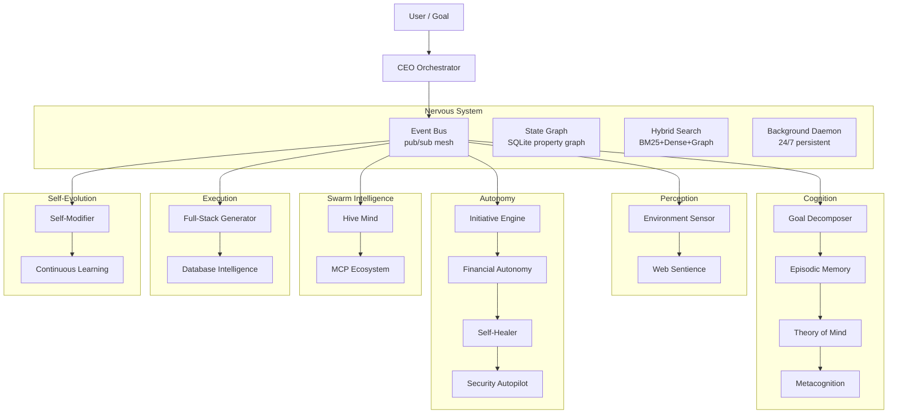

<p align="center">
  <picture>
    <source media="(prefers-color-scheme: dark)" srcset="assets/Custom-pi-logo.png">
    
  </picture>
</p>

# The Autonomous AI Coding Agent

[](https://www.npmjs.com/package/custom-pi)
[](LICENSE)
[](https://github.com/IamNishant51/Custom-PI/actions/workflows/ci.yml)
[](CONTRIBUTING.md)
[](https://nodejs.org)

**[Landing Page](https://custom-pi-ai.vercel.app)** |
**Built by [Nishant Unavane](https://nishantunavane.qzz.io)**

Custom-PI is a self-evolving autonomous AI coding agent with persistent knowledge graph memory, multi-agent DAG swarm orchestration, free AI image generation, and full social media automation. Built on the [Pi Coding Agent](https://www.npmjs.com/package/@earendil-works/pi-coding-agent).

*AI coding assistants were used in the development of Custom-PI.*

---

## 1. Key Features

| Feature | Description |
|---|---|
| **Free AI Image Generation** | Generate 4 images via Pollinations.ai — Flux, GPT Image, Seedream models. Zero cost, no API key needed. |
| **Social Media Automation** | Post to Twitter/X, Reddit, Bluesky, Discord, Telegram with full browser automation and persistent login. |
| **Knowledge Graph Memory** | SQLite-backed triplet store (Subject→Predicate→Object) with confidence scoring, TTL-based pruning, and automatic LLM extraction. |
| **DAG Swarm Orchestration** | Multi-agent pipelines (Researcher → Writer → Publisher) running in parallel — no single-agent dead-ends. |
| **26+ Autonomous Subsystems** | Event bus, state graph, goal decomposer, episodic memory, theory of mind, metacognition, initiative engine, self-healer, security autopilot, and more. |
| **40+ Built-in Tools** | Browser automation, LSP code intelligence, AST-grep, email (OAuth 2.0), encrypted vault, SSH, web search, image generation, and social posting. |
| **Dual Dashboards** | Fullscreen terminal TUI + real-time React web dashboard with canvas editor, document editor, voice chat, 3D avatar, and swarm commander. |
| **Webhook Ingestion** | Receive events from Sentry, Datadog, GitHub — LLM-parsed failure triplets with proactive triage. |
| **Secure Sandbox** | Enforced approval gates, AES-256-GCM encrypted vault, isolated plugin execution with resource limits. |

---

## 2. Quick Start

```bash
npm install -g custom-pi

# For browser automation (social posting):
npx playwright install chromium

# Launch:
custom-pi          # Terminal dashboard
custom-pi-web      # Web dashboard at http://localhost:4321
```

---

## 3. Architecture



All 26+ subsystems communicate through a typed event bus and persist state in a unified property graph database. See [AGENTS.md](AGENTS.md) for the complete reference.

---

## 4. Free Image Generation — In Action

```
Agent: generate_image(provider: "free", prompt: "futuristic cityscape cyberpunk", count: 4)
  → 4 images generated, saved to ~/.pi/assets/
  → User picks one in AssetSelector modal
  → Selected image attached to social post
```

Default provider is Pollinations.ai — no API key, no signup. Set `provider: "designapi"` with a `DESIGN_API_KEY` for Flux Pro, DALL-E 3, Recraft v3, and Ideogram.

---

## 5. Tool Arsenal (40+)

### Media Synthesis
`generate_image` · `request_asset_selection` · `text_to_speech` · `render_mermaid`

### Social & Broadcast
`request_post_approval` · `post_to_twitter` · `post_to_reddit` · `post_to_bluesky` · `post_to_discord` · `post_to_telegram`

### Knowledge & Memory
`memory_store` · `memory_search` · `memory_edit` · `vault_set` · `vault_get` · `vault_delete` · `vault_list` · `vault_import`

### Search & Web
`web_search` · `web_fetch` · `internal_url`

### Browser & Shell
`browser` · `bash` · `ssh_exec`

### Code Intelligence
`lsp` · `ast_grep` · `hashline_edit`

### Integrations
`github` · `send_email` · `plugin`

### Ascension (Autonomous)
`initialize_ascension` · `shutdown_ascension` · `decompose_goal` · `long_term_plan` · `causal_analyze` · `create_tool`

---

## 6. Local Setup

### From source

```bash
git clone https://github.com/IamNishant51/Custom-PI.git
cd Custom-PI
npm install
npx playwright install chromium
npm start              # Terminal dashboard
npm run web            # Web dashboard
```

---

## 7. Testing

```bash
npm test               # Unit + integration tests (406+ tests)
npx tsc --noEmit       # TypeScript compliance
```

---

## 8. Contributing

Contributions are welcome! See [CONTRIBUTING.md](CONTRIBUTING.md) for setup instructions, code conventions, and the pull request process. This project also uses a [Code of Conduct](CODE_OF_CONDUCT.md) and has a [security policy](SECURITY.md).

Look for issues tagged [`good first issue`](https://github.com/IamNishant51/Custom-PI/issues?q=is%3Aissue+is%3Aopen+label%3A%22good+first+issue%22).

---

## License

MIT — Free to use, modify, and distribute. See [LICENSE](LICENSE).

---

<p align="center">Built by <a href="https://nishantunavane.qzz.io">Nishant Unavane</a></p>
