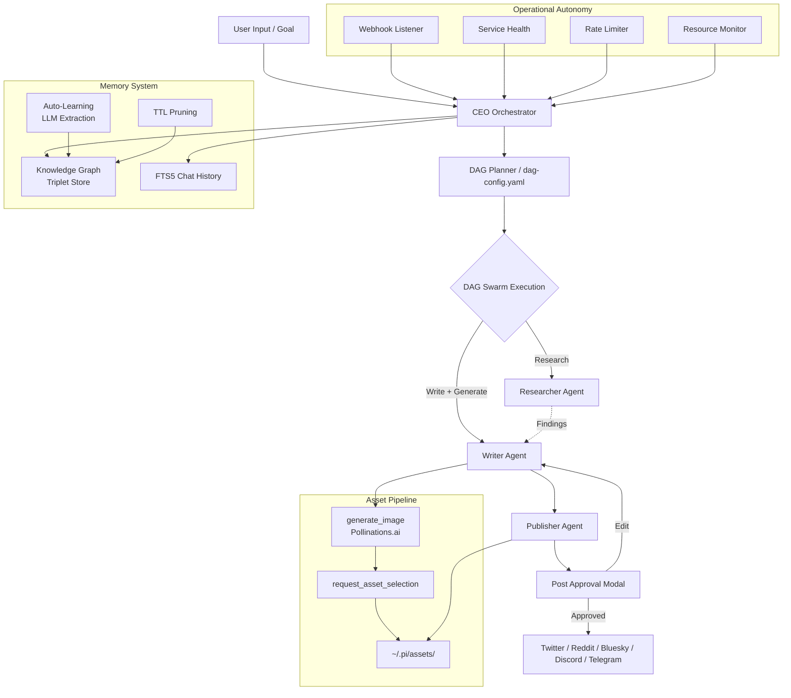

*HERMES meets PAPERCLIP — the coding agent that never forgets, never stops, and never asks twice.*  
*Knowledge graph memory · Free AI image generation · Social media automation · DAG swarms · Web dashboard*


[](https://www.npmjs.com/package/custom-pi)
[](https://opensource.org/licenses/MIT)
[](https://nodejs.org)


---

## 🔥 What's New — Free AI Image Generation

**Generate stunning visuals for social media posts at zero cost — no API keys, no subscriptions, no hidden fees.**

custom-pi now includes a complete **free image generation pipeline** powered by [Pollinations.ai](https://pollinations.ai). The agent can generate, select, and attach images to social media posts entirely for free.

```mermaid
graph LR
  A[Agent prompts<br/>generate_image] --> B[Pollinations.ai<br/>4 images · free]
  B --> C[Saved to<br/>~/.pi/assets/]
  C --> D[AssetSelector modal<br/>shows 4 images]
  D --> E[User picks one]
  E --> F[Others auto-deleted]
  F --> G[Image attached<br/>to social post]
  
  style A fill:#1a1a2e,stroke:#00d7ff
  style B fill:#1a1a2e,stroke:#00ff88
  style D fill:#1a1a2e,stroke:#ff6b6b
  style G fill:#1a1a2e,stroke:#af00ff
```



### Features

| Feature | Description |
|:---|:---|
| **🎨 Free Generation** | Generate images via Pollinations.ai — Flux, GPT Image, Seedream models. Zero cost, unlimited use. |
| **🔑 No API Keys** | Defaults to free provider. No signup, no credit card, no configuration. |
| **🖼️ Batch Generation** | Creates 4 images by default with different seeds — more variety, better picks. |
| **👆 Visual Selection** | AssetSelector modal shows all generated images in a grid — click to pick, rest auto-deleted. |
| **📁 Asset Gallery** | All generated images saved to `~/.pi/assets/` with preview, copy-path, and delete controls. |
| **📱 Post Integration** | Selected image attaches directly to social media posts in the approval preview. |
| **⚡ Premium Option** | Set `provider: "designapi"` with a `DESIGN_API_KEY` for Flux Pro, DALL-E 3, Recraft, Ideogram. |

---

## The Fusion

Hermes represents the swift, articulate messenger. The Paperclip Maximizer represents the theoretical model of absolute, relentless optimization toward a target goal.

custom-pi is a premium engineering extension suite for the Pi Coding Agent. It equips the host agent with persistent context recall, multi-agent wave orchestration, safe system execution tooling, **full operational autonomy**, and **zero-cost media generation** — the ability to proactively research, write, generate visuals for, and publish social media content without continuous user intervention.

* **Free AI Image Generation**: Built-in Pollinations.ai integration. Generate 4 images, pick the best, attach to posts — all free.
* **Social Media Automation**: Post to Twitter/X, Reddit, Bluesky, Discord, Telegram — full browser automation with persistent login.
* **Asset Pipeline**: Generate → Select → Attach → Publish. Complete visual content workflow.
* **Knowledge Graph Memory**: SQLite-backed triplet store (Subject→Predicate→Object) with confidence scoring, TTL-based pruning, and automatic extraction.
* **Tiered Context Recall**: Intent classification drives FTS5 chat history, knowledge graph, or system state queries with cascading fallback.
* **DAG Swarms**: Multi-agent pipelines (Researcher, Writer, Publisher) running in parallel — no single-agent dead-ends.
* **Deployment Orchestration**: Stateful CI/CD pipeline — PR → build → tests → staging → smoke tests → production — with auto-rollback.
* **Webhook Ingestion**: Receive events from Sentry, Datadog, GitHub. LLM-parsed failure triplets with proactive triage.
* **Service Health Monitoring**: Periodic endpoint checks — latency, jitter, consecutive failures. Contextual advisories adjust planning.
* **Adaptive Throttling**: Circuit breaker with exponential backoff. Resource-aware task scoring adjusts parallelism.
* **40+ Built-in Tools**: OS, browser, LSP, AST-grep, email, cryptographic vault, SSH, social posting, image generation.
* **Dual Dashboards**: Fullscreen TUI + real-time React web dashboard.
* **Secure Sandbox**: Enforced approval gates, AES-256 encrypted vault, isolated plugin execution.

---

## 🚀 Quick Start

### Installation

```bash
npm install -g custom-pi
```

For browser automation (social posting, image automation):

```bash
npx playwright install chromium
```

For IDE code intelligence:

```bash
npm install -g typescript-language-server
pip install pyright
```

### Launch

```bash
custom-pi          # Terminal dashboard
custom-pi-web      # Web dashboard at http://localhost:4321
```

---

## 🎨 Free Image Generation — In Action

### Agent Workflow

The `generate_image` tool defaults to Pollinations.ai — no API key needed:

```
Agent: generate_image(provider: "free", prompt: "futuristic cityscape cyberpunk", count: 4)
  → 4 images generated, saved to ~/.pi/assets/
  → "Call request_asset_selection with filenames: [...]"

Agent: request_asset_selection(filenames: [...], prompt: "futuristic cityscape")
  → AssetSelector modal opens in web UI
  → User clicks preferred image
  → Others auto-deleted
  → "Selected: asset_171234_2.png"

Agent: request_post_approval(platform: "twitter", content: "...", assetUrl: "asset_171234_2.png")
  → PostApproval shows tweet + image side by side
  → User approves
  → Published to Twitter/X
```

### Manual Use

Any agent or chat can generate images on demand:

```
"generate an image of a robot cooking breakfast and save it"
```

### Premium Models

Set `provider: "designapi"` and add a `DESIGN_API_KEY` to your vault for access to Flux Pro, DALL-E 3, Recraft v3, and Ideogram.

---

## 📱 Social Media Automation

custom-pi automates the entire social media workflow — research, draft, generate visuals, approve, publish.

### Connected Platforms

| Platform | Authentication | Capabilities |
|:---|:---|:---|
| **Twitter / X** | Browser login | Post tweets with images, threads |
| **Reddit** | Browser login | Submit posts with titles, subreddit targeting |
| **Bluesky** | Browser login | Publish text updates |
| **Discord** | Bot token / Webhook | Channel messages, embeds |
| **Telegram** | Bot token | Channel posts, media |

### Swarm Commander

The **Social Media Manager** swarm handles the full pipeline:

1. **Researcher** — Finds trending topics, news, and content ideas using web search
2. **Writer** — Drafts platform-optimized posts AND generates matching visuals
3. **Publisher** — Shows previews for approval, publishes to connected platforms

---

## Interactive Architecture Flow



---

## Tool Arsenal (40+)

### Media Synthesis

* `generate_image` — **Free image generation** via Pollinations.ai (default, no key needed) or premium DesignAPI/OpenAI/Gemini/Grok. Generates 4 images, saves to asset gallery.
* `request_asset_selection` — Shows generated images in a selection modal. User picks one, rest auto-deleted.
* `text_to_speech` — Edge-tts CLI returning audio buffers.
* `render_mermaid` — Compiles Mermaid diagrams to SVG with ASCII fallback.

### Social & Broadcast

* `request_post_approval` — Shows formatted post preview with attached image. User Approves, Edits, or Skips.
* `post_to_twitter` — Tweet with optional image attachment.
* `post_to_reddit` — Submit posts with title and subreddit targeting.
* `post_to_bluesky` / `post_to_discord` / `post_to_telegram` — Platform-specific publishing.

### Knowledge & Memory

* `memory_store` / `memory_search` / `memory_edit`: TF-IDF vector memory with recency decay.
* `/triplets`: Knowledge graph queries — list triplets, drill into entities.
* `vault_set` / `vault_get` / `vault_delete` / `vault_list` / `vault_import`: AES-256-GCM encrypted credential storage.

### Search & Web

* `web_search`: Multi-tier search (DuckDuckGo → Algolia → Wikipedia).
* `web_fetch`: Page fetching with HTML-to-Markdown and user-agent rotation.
* `internal_url`: Internal schema router (`memory://`, `vault://`, `local://`, etc.).

### Browser & Shell

* `browser`: Headless Chromium — navigate, type, click, screenshot, extract.
* `ssh_exec`: Remote command execution with secure key management.

### Code Intelligence

* `lsp`: Language server protocol — hover, symbols, rename, diagnostics.
* `ast_grep`: Structural syntax search across 11 languages.
* `hashline_edit`: Content-hash validated safe editing.

### Integrations

* `github`: Full GitHub API — issues, PRs, code search.
* `send_email`: Gmail via OAuth 2.0 Device Flow.
* `plugin`: Dynamic JavaScript extension system.

### Orchestration

* `plan`: Multi-step checklist creation and tracking.
* `session`: State checkpoint serialization.
* `todo_write`: Structured task lists.

---

## Multi-Agent Swarms

Configure parallel workflows with `~/.pi/agent/dag-config.yaml`:

```yaml
version: 1
mode: pipeline
pipeline_count: 3
agents:
  - id: researcher
    role: Research specifications and codebase structure
    tools: [web_search, web_fetch, memory_search]
    waits_for: []
  - id: coder
    role: Implement features and fix bugs
    tools: [write, edit, bash, glob, grep]
    waits_for: [researcher]
  - id: reviewer
    role: Validate type checks, tests, compiler
    tools: [bash, glob, grep, lsp]
    waits_for: [coder]
```

### Execution Modes

| Mode | Behavior |
|:---|:---|
| **pipeline** | Iterative loop — reviewer validates, CEO routes feedback |
| **parallel** | All agents concurrent when tasks don't overlap |
| **sequential** | Strict single-lane dependency chain |

### Default Swarm: Social Media Manager

custom-pi ships with a pre-configured **Social Media Manager** team:

| Agent | Role | Tools |
|:---|:---|:---|
| **Researcher** | Finds trending topics and content ideas | `web_search`, `web_fetch`, `write` |
| **Writer** | Drafts posts + generates visuals | `write`, `edit`, `read`, `generate_image`, `request_asset_selection` |
| **Publisher** | Shows previews, publishes | `post_to_twitter`, `post_to_reddit`, `post_to_bluesky`, `post_to_discord`, `post_to_telegram`, `request_post_approval` |

---

## 🌐 Web Dashboard

The React dashboard provides real-time control over all features:

| Tab | What you can do |
|:---|:---|
| **Swarm Commander** | Launch teams, view agent logs, select generated assets, approve posts |
| **Asset Gallery** | Browse generated images, preview, copy paths, delete |
| **Chat** | Real-time streaming agent output |
| **Dashboard** | System telemetry, budget, vault, MCP servers |
| **Memory** | TF-IDF semantic search and storage |
| **Knowledge Graph** | Triplet table with confidence slider, entity drill-down |
| **Pipeline** | Deployment stages status |
| **Health** | Service health, CPU/RAM, rate limits |
| **Social Accounts** | Connect/disconnect Twitter, Reddit, Bluesky, Discord, Telegram |
| **Secrets Vault** | Encrypted credential management |
| **Budget** | Token/cost tracking |

---

## Operational Autonomy

### Webhook Ingestion & Anomaly Detection

Runs a webhook listener at `POST /api/webhooks/:source` accepting events from Sentry, Datadog, GitHub Actions. Each event is normalized → LLM-parsed → persisted as a failure triplet → aggregated into incidents. 3+ related failures trigger automatic triage.

### Service Health Monitoring

Periodic external endpoint checks tracking latency, jitter, consecutive failures. Status classifications from excellent (<50ms) to critical (>2s) feed contextual planning advisories.

### Rate Limit Management

Circuit breaker pattern tracking `X-RateLimit-Remaining` headers. Below threshold flips `RATE_LIMIT_BREACH` flag with exponential backoff (`1s × 2ⁿ`, capped at 60s).

### Resource-Aware Scheduling

Reads `/proc/stat` and `/proc/meminfo` every check cycle. Task priority scored as `Score = Importance / (Resources × Cost)`. At 90% CPU, parallel execution cost skyrockets — favors sequential.

---

## Memory System

### Knowledge Graph (Triplet Store)

SQLite-backed: `(Subject) → [Predicate] → (Object)`. Each triplet has confidence score (0.0–1.0), entity type (tool, file, function, class, concept, dependency, setting, person), and TTL (7d–5y).

```
/triplets            — List top 20 entries
/triplets <entity>   — Drill into connections
```

### TF-IDF Semantic Memory

Vector memory using cosine similarity with recency decay:

$$\text{Retrieved Weight} = \text{Cosine Similarity}(Q, M_i) \times e^{-\lambda t}$$

### Auto-Learning

Every significant tool output is LLM-parsed for triplet extraction. Validated against TripletRecord schema, deduplicated, upserted into knowledge graph (min confidence: 0.4).

### Memory Pruning

Daily cron: TTL-based staleness deletion + redundancy merging (near-duplicate triplets keep highest confidence). All actions logged to `prune-log.json`.

---

## Runtime File Structure

```
~/.pi/agent/
├── SOUL.md                 # Identity definition
├── SYSTEM.md               # Core programming rules
├── settings.json           # Model profiles
├── models.json             # API keys and providers
├── session-state.db        # SQLite (messages, triplets, health, rate limits)
├── dag-config.yaml         # Swarm configurations
├── mcp-servers.json        # MCP server definitions
├── lsp-servers.json        # LSP server mappings
├── assets/                 # Generated images
│   ├── asset_171234_0.png
│   ├── asset_171234_1.png
│   └── asset_171234_2.png
├── .vault/
│   ├── master.key          # 32-byte hex key
│   └── vault.json          # Encrypted key-value store
├── plugins/                # Dynamic script extensions
├── checkpoints/            # Session snapshots
├── costs/                  # Token usage logs
├── work-products/          # Created/modified files ledger
├── webhooks/               # Incoming event storage
└── web/                    # Vite client distribution
```

---

## Testing

```bash
npm test                 # Unit + integration tests
npx tsc --noEmit         # TypeScript compliance
```

---

## License

MIT — Free to use, modify, and distribute.

---

## Contributing

1. Fork the repo, create a feature branch from `main`.
2. Ensure all tests pass: `npm test && npx tsc --noEmit`.
3. Open a PR with a clear title and description.
4. At least 1 review approval required. No direct pushes to `main`.

### Reporting Issues

[github.com/IamNishant51/Custom-PI/issues](https://github.com/IamNishant51/Custom-PI/issues)

---

**Hermes speed + Paperclip obsession = custom-pi**  
*Free images. Social automation. One agent to bind them all.*
