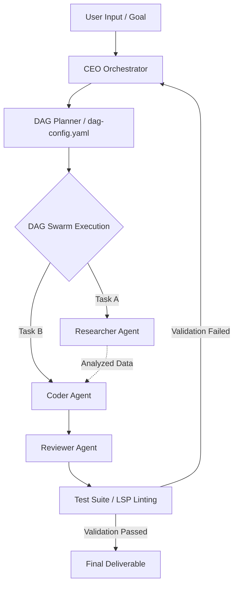

```
  ██████╗ ██╗   ██╗ ██████╗ ████████╗ ██████╗ ███╗   ███╗      ██████╗ ██╗
 ██╔════╝ ██║   ██║██╔════╝ ╚══██╔══╝██╔═══██╗████╗ ████║      ██╔══██╗██║
 ██║      ██║   ██║╚██████╗    ██║   ██║   ██║██╔████╔██║█████╗██████╔╝██║
 ██║      ██║   ██║ ╚═══██║    ██║   ██║   ██║██║╚██╔╝██║╚════╝██╔═══╝ ██║
 ╚██████╗ ╚██████╔╝██████╔╝    ██║   ╚██████╔╝██║ ╚═╝ ██║      ██║     ██║
  ╚═════╝  ╚═════╝ ╚═════╝     ╚═╝    ╚═════╝ ╚═╝     ╚═╝      ╚═╝     ╚═╝
```

<p align="center">
  <b>HERMES meets PAPERCLIP — the coding agent that never forgets, never stops, and never asks twice.</b><br/>
  <i>32+ tools | DAG swarm orchestration | Semantic memory | Web UI | LSP | MCP | Vault | SSH</i>
</p>

<p align="center">
  <a href="https://www.npmjs.com/package/custom-pi"></a>
  <a href="https://opensource.org/licenses/MIT"></a>
  <a href="https://nodejs.org"></a>
  
  
  
</p>

<p align="center">
  
</p>

---

## The Fusion

Hermes represents the swift, articulate messenger. The Paperclip Maximizer represents the theoretical model of absolute, relentless optimization toward a target goal.

custom-pi is a premium engineering extension suite for the Pi Coding Agent. It equips the host agent with persistent context recall, multi-agent wave orchestration, and safe system execution tooling.

* **Durable Context**: Cognitive memory tracking utilizing TF-IDF semantic vector similarity combined with recency decay factors.
* **DAG Swarms**: Multi-agent pipelines (Researcher, Coder, Reviewer) running in parallel to prevent single-agent execution dead-ends.
* **32+ Built-in Tools**: Full-featured OS, browser, LSP, AST-grep, email, cryptographic vault, SSH, and social posting integration.
* **Dual Dashboards**: Stream reasoning and execution logs in real-time through an interactive fullscreen TUI or a React-based web dashboard.
* **Secure Sandbox**: Enforced user approval gates, AES-256 encrypted configuration storage, and isolated custom plugins execution.

---

## Interactive Architecture Flow

The workflow diagram below illustrates how custom-pi coordinates task completion through the CEO Orchestrator, the subagent swarm, and the diagnostic verification layer:



---

## Quick Start

### Installation

Install the package globally using npm:

```bash
npm install -g custom-pi
```

To run browser automation tasks, install Playwright's Chromium binary:

```bash
npx playwright install chromium
```

For full IDE code intelligence support, make sure you have appropriate language servers installed locally:

```bash
npm install -g typescript-language-server
pip install pyright
```

### Launch Commands

Start the terminal dashboard interface:

```bash
custom-pi
```

Start the React web server (served locally at http://localhost:4321):

```bash
custom-pi-web
```

---

## Technical Specifications

| Objective | Legacy Limitation | custom-pi Resolution |
| :--- | :--- | :--- |
| **Context Retention** | Agents lose state and forget decisions across sessions. | **TF-IDF semantic vector space** with cosine similarity matching and recency decay. |
| **Problem Solving** | Single agents get stuck in recursive bugs or loops. | **DAG swarms** that delegate specialized roles (Research, Coding, Reviewing) concurrently. |
| **Interface Telemetry** | Plain terminal scrolling output makes tracking swarms difficult. | **Double-buffered fullscreen TUI** alongside a WebSocket-driven React dashboard. |
| **Credentials Storage** | Storing API keys in plaintext files or config variables. | **AES-256-GCM encrypted vault** with programmatic key generation. |
| **Code Understanding** | Regex-based file search lacks structural and type context. | **LSP client integration** with ast-grep queries for 11+ languages. |
| **Web Access** | Incapable of logging in or interacting with complex JavaScript apps. | **Playwright integration** for screenshot capture, selector querying, and action execution. |

---

## Tool Arsenal (32+)

### Search and Web Automation

* `web_search`: Multi-tier search fallback chain (DuckDuckGo -> Algolia HackerNews -> Wikipedia).
* `web_fetch`: Programmatic page fetching with HTML-to-Markdown parsing and automatic user-agent rotation.
* `internal_url`: URL router handling internal schemas (`memory://`, `vault://`, `local://`, `issue://`, `pr://`, `skill://`, `rule://`).

### Headless Browser & Shell

* `browser`: Navigate, type, click, screenshot (base64 PNG), and extract node content via headless Chromium.
* `ssh_exec`: Execution of remote host commands with secure temporary SSH key and password management.

### Code Intelligence

* `lsp`: Programmatic interface for language servers supporting hover definitions, symbols, rename, and diagnostic arrays.
* `ast_grep`: Structural syntax tree search across 11 programming languages.
* `hashline_edit`: Content-hash validated code editing to ensure merge safety and prevent corrupt patches.

### Integrations and Messaging

* `github`: Full integration with the GitHub API for issues, pull request tracking, and branch-specific code search.
* `send_email`: Compose and dispatch emails using the Gmail API via OAuth 2.0 Device Flow authorization.

### Broadcast & Social API

* `post_to_reddit`: Submit post payloads via Reddit OAuth password grant.
* `post_to_bluesky`: AT Protocol client helper for publishing text updates.
* `post_to_discord`: Webhook integration for system logs broadcasting.
* `post_to_telegram`: Bot API integration for secure command updates.

### Memory & Encryption

* `memory_store` / `memory_search` / `memory_edit`: Create, retrieve, and update TF-IDF memory vectors.
* `vault_set` / `vault_get` / `vault_delete` / `vault_list` / `vault_import`: Cryptographically secure storage mapped to AES-256-GCM encryption.

### Media Synthesis

* `generate_image`: Automated image rendering using DALL-E 3, Gemini, or Grok based on active vault credentials.
* `text_to_speech`: Edge-tts CLI client returning audio base64 buffers.
* `render_mermaid`: Compiles Mermaid diagrams into SVG vectors with ASCII fallbacks.

### Orchestration & State

* `plan`: Formulate, track, and complete multi-step checklists.
* `session`: Checkpoint serialization containing execution states, tools, and variables.
* `plugin`: Register, configure, and isolate dynamic JavaScript extensions.

---

## Multi-Agent Swarms

Configure parallel multi-agent workflows using `~/.pi/agent/dag-config.yaml`:

```yaml
version: 1
mode: pipeline
pipeline_count: 3
agents:
  - id: researcher
    role: Research specifications and codebase structure
    tools: [web_search, web_fetch, memory_search]
    waits_for: []
  - id: coder
    role: Implement software features and bug fixes
    tools: [write, edit, bash, glob, grep]
    waits_for: [researcher]
  - id: reviewer
    role: Validate type checks, tests, and run compiler
    tools: [bash, glob, grep, lsp]
    waits_for: [coder]
```

### Swarm Execution Configurations

* **pipeline**: Iterative loop. Reviewer validates output, and the CEO Orchestrator routes feedback to the Coder/Researcher if defects are found.
* **parallel**: Executes all agents concurrently when task definitions do not overlap.
* **sequential**: Strict single-lane dependency execution.

---

## Memory and Vault Operations

### Mathematical Model for Memory Decay

To keep context relevant, the retrieval system calculates memory weights dynamically. The score decays exponentially based on age:

$$\text{Retrieved Weight} = \text{Cosine Similarity}(Q, M_i) \times e^{-\lambda t}$$

Where:
* $Q$ is the active query vector.
* $M_i$ is the target memory vector.
* $\lambda$ is the decay constant.
* $t$ is the time elapsed since the memory was captured.

### Vault Encryption Details

The secure storage subsystem generates a random 12-byte Initialization Vector (IV) and creates a ciphertext containing an Authentication Tag using AES-256-GCM.

```
Plaintext Credential + Master Key -> AES-256-GCM -> Ciphertext + 12-Byte IV + 16-Byte Auth Tag
```

If `CUSTOM_PI_VAULT_KEY` is not present in the environment variables, the system reads the key from `~/.pi/agent/.vault/master.key` (enforcing `0600` owner-only read permissions).

---

## Runtime File Structure

All assets, extensions, and configurations are synchronized locally in your home directory:

```
~/.pi/agent/
├── SOUL.md                 # Identity definition injected on turn start
├── SYSTEM.md               # Core programming and formatting rules
├── settings.json           # Model profiles and active configurations
├── models.json             # API keys and provider targets
├── semantic.json           # SQLite FTS5 database indices
├── semantic.vec.json       # Compiled TF-IDF vectors
├── session-state.json      # Periodic state snapshots (every 10 turns)
├── dag-config.yaml         # Active swarm configurations
├── mcp-servers.json        # MCP server definition list
├── lsp-servers.json        # LSP server executables mapping
├── checkpoints/            # Directory containing past session snapshots
├── costs/                  # Log files tracking token usage and cost bounds
├── work-products/          # Ledger mapping created and modified files
├── plugins/                # Directory containing dynamic script extensions
├── .vault/                 # Secure storage directory
│   ├── master.key          # 32-byte hex master key
│   └── vault.json          # Encrypted key-value database
└── web/                    # Distribution containing Vite client assets
```

---

## Testing & Verification

Verify the system by running the full unit and integration test suites:

```bash
npm test
```

### Test Logs Sample

```
[OK] soul-loader                  [OK] secret-vault
[OK] memory-file-store            [OK] cost-tracker
[OK] memory-nudge                 [OK] work-products
[OK] state-db                     [OK] cron-scheduler
[OK] skill-store                  [OK] web-search
[OK] skill-retrieval              [OK] memory-embedding
[OK] memory-embedding-upgrade     [OK] hashline
[OK] tui-colors                   [OK] mcp-client
[OK] lsp-integration              [OK] session-management

142 tests passed across 18 test files
```

Check TypeScript type compiler compliance:

```bash
npx tsc --noEmit
```

---

## License

MIT - Licensed under the MIT License. Free to use, modify, and distribute.

---

<p align="center">
  <b>Hermes speed + Paperclip obsession = custom-pi</b><br/>
  <i>One agent to configure them all. And in the terminal bind them.</i>
</p>
