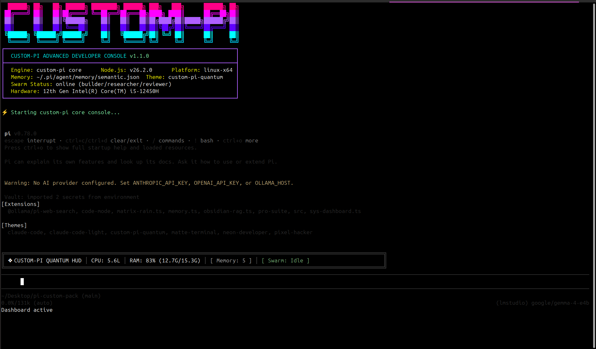

# CUSTOM-PI

```
  ██████╗ ██╗   ██╗ ██████╗ ████████╗ ██████╗ ███╗   ███╗      ██████╗ ██╗
 ██╔════╝ ██║   ██║██╔════╝ ╚══██╔══╝██╔═══██╗████╗ ████║      ██╔══██╗██║
 ██║      ██║   ██║╚██████╗    ██║   ██║   ██║██╔████╔██║█████╗██████╔╝██║
 ██║      ██║   ██║ ╚═══██║    ██║   ██║   ██║██║╚██╔╝██║╚════╝██╔═══╝ ██║
 ╚██████╗ ╚██████╔╝██████╔╝    ██║   ╚██████╔╝██║ ╚═╝ ██║      ██║     ██║
  ╚═════╝  ╚═════╝ ╚═════╝     ╚═╝    ╚═════╝ ╚═╝     ╚═╝      ╚═╝     ╚═╝
```

<p align="center">
  <b>⚡ HERMES meets PAPERCLIP — the coding agent that never forgets, never stops, and never asks twice.</b><br/>
  <i>32+ tools • DAG swarm orchestration • Semantic memory • Web UI • LSP • MCP • Vault • SSH</i>
</p>

<p align="center">
  <a href="https://www.npmjs.com/package/custom-pi"></a>
  <a href="https://opensource.org/licenses/MIT"></a>
  <a href="https://nodejs.org"></a>
  
  
  
</p>

<p align="center">
  
</p>

---

## 🧬 The Fusion

> **Hermes** — the messenger god, swift and articulate. **Paperclip Maximizer** — the thought experiment that became a legend, tirelessly optimizing toward its goal.

**custom-pi** is what happens when you give a coding agent the speed of Hermes and the relentless focus of the Paperclip. It's a premium extension suite for the [Pi Coding Agent](https://www.npmjs.com/package/@earendil-works/pi-coding-agent) that adds:

- **Memory that lasts** — TF-IDF semantic vectors, not brittle keyword search
- **DAG-powered swarms** — orchestrate 3+ agents in parallel waves
- **32+ production tools** — browser, GitHub, email, SSH, image gen, TTS, and more
- **Full web UI** — real-time streaming, dashboards, vault manager, memory browser
- **Encrypted everything** — AES-256 vault, sandboxed plugins, approval gates
- **Code intelligence** — LSP diagnostics, goto-def, rename across 5 languages
- **Zero config** — install once, everything syncs automatically

---

## 🚀 Quick Start

```bash
npm install -g custom-pi

# Launch terminal UI
custom-pi

# Launch web UI (served at http://localhost:4321)
custom-pi-web
```

That's it. The first run copies all agent configs, themes, system prompts, and extension modules to `~/.pi/agent/`. No manual setup required.

### Prerequisites

- **Node.js** >= 18.0.0
- **Playwright** (for browser automation): `npx playwright install chromium`
- **Language servers** (for LSP): `npm install -g typescript-language-server`, `pip install pyright`, etc.

---

## 🎯 Why CUSTOM-PI?

| Problem | Solution |
|---------|----------|
| Agents forget context between sessions | **TF-IDF semantic memory** with cosine similarity + recency decay |
| Single agents hit dead ends | **DAG swarm** — 3 agents (researcher/coder/reviewer) in pipeline/parallel waves |
| No web interface | **React + Vite web UI** with real-time WebSocket streaming |
| Secrets in plaintext config files | **AES-256-GCM vault** with import/export |
| No code intelligence | **LSP client** — diagnostics, goto-def, rename across 5 languages |
| Can't browse the web | **Playwright browser** — navigate, click, type, screenshot, extract |
| Can't use GitHub | **GitHub API** — issues, PRs, code search, file read |
| No planning | **Multi-step plans** with CRUD, status tracking, auto-completion |
| Expensive API keys for search | **3 free providers** — DuckDuckGo → HackerNews → Wikipedia fallback |
| Twitter paywall | **Browser automation** — free posting via Playwright |

---

## 🛠️ Tool Arsenal (32+)

### 🔍 Search & Web
| Tool | What it does |
|------|-------------|
| `web_search` | DuckDuckGo → HackerNews Algolia → Wikipedia (free fallback chain) |
| `web_fetch` | HTML/JSON parsing, 15s timeout, auto User-Agent |
| `internal_url` | 8-protocol router: `memory://`, `vault://`, `local://`, `omp://`, `issue://`, `pr://`, `skill://`, `rule://` |

### 🤖 Browser & Automation
| Tool | What it does |
|------|-------------|
| `browser` | Navigate, click, type, screenshot (base64 PNG), extract (selector/full page) |
| `ssh_exec` | Remote execution with key/password auth, temp key cleanup |

### 💻 Code Intelligence
| Tool | What it does |
|------|-------------|
| `lsp` | Diagnostics, goto-def, references, hover, symbols, rename, code actions (TS/JS/Python/Rust/Go) |
| `ast_grep` | Structural search — functions, classes, imports (11 languages) |
| `hashline_edit` | Content-hash validated patches with 3-way merge recovery |

### 🔐 GitHub & Email
| Tool | What it does |
|------|-------------|
| `github` | Issues, PRs, code search, file read by branch |
| `send_email` | Gmail OAuth 2.0 device flow with auto-refresh |

### 📱 Social
| Tool | What it does |
|------|-------------|
| `post_to_reddit` | OAuth 2.0 password grant |
| `post_to_bluesky` | AT Protocol |
| `post_to_discord` | Webhook |
| `post_to_telegram` | Bot API |

### 🧠 Memory & Vault
| Tool | What it does |
|------|-------------|
| `memory_store/search/edit` | TF-IDF semantic vectors with importance scoring |
| `vault_set/get/delete/list/import` | AES-256-GCM encrypted storage |

### 🎨 Media
| Tool | What it does |
|------|-------------|
| `generate_image` | DALL-E 3 / Gemini / Grok — auto-selects from available keys |
| `text_to_speech` | edge-tts CLI with base64 audio |
| `render_mermaid` | SVG rendering with ASCII fallback |

### 📋 Planning & Management
| Tool | What it does |
|------|-------------|
| `plan` | Multi-step plans with CRUD, auto-completion |
| `session` | Checkpoint save/restore/compact with full state capture |
| `plugin` | List, create, enable/disable, sandboxed execution |
| `todo_write` | Persistent phased task lists |

---

## 🌐 Web UI

The web interface gives you full control without touching the terminal:

- **Chat** — streaming LLM responses, tool call cards, conversation history
- **Swarm Dashboard** — agent status, DAG execution logs, CEO console
- **Vault Manager** — add, reveal, delete encrypted secrets
- **Budget Panel** — token/cost stats, session/daily limits
- **Memory Browser** — search, store, browse semantic facts
- **Work Products** — every file the agent created or modified

```bash
custom-pi-web
# → http://localhost:4321
```

---

## 🧩 DAG Swarm Orchestration

Define multi-agent workflows in `~/.pi/agent/dag-config.yaml`:

```yaml
version: 1
mode: pipeline
pipeline_count: 3
agents:
  - id: researcher
    role: Research and gather information
    tools: [web_search, web_fetch, memory_search]
    waits_for: []
  - id: coder
    role: Implement solutions
    tools: [write, edit, bash, glob, grep]
    waits_for: [researcher]
  - id: reviewer
    role: Review and validate
    tools: [bash, glob, grep, lsp]
    waits_for: [coder]
```

3 modes: **pipeline** (N iterations with CEO feedback), **parallel** (all at once), **sequential** (one by one). Cycle detection via Kahn's algorithm. Failure isolation per agent.

---

## 🔌 MCP & LSP Integration

**MCP Servers** — configure in `~/.pi/agent/mcp-servers.json`:

```json
[
  { "name": "sequential-thinking", "command": "npx", "args": ["-y", "@modelcontextprotocol/server-sequential-thinking"] },
  { "name": "filesystem", "command": "npx", "args": ["-y", "@modelcontextprotocol/server-filesystem", "/workspace"] }
]
```

**LSP Servers** — started on-demand per language:

```json
{
  "typescript": { "command": "typescript-language-server", "args": ["--stdio"] },
  "python": { "command": "pyright-langserver", "args": ["--stdio"] },
  "rust": { "command": "rust-analyzer", "args": [] },
  "go": { "command": "gopls", "args": [] }
}
```

---

## 📁 File Layout

```
~/.pi/agent/
├── SOUL.md                # Identity layer (loaded as first prompt block)
├── SYSTEM.md              # System instructions
├── settings.json          # Default model, etc.
├── models.json            # Model provider configs
├── semantic.json          # TF-IDF memory entries
├── semantic.vec.json      # Pre-computed vectors
├── session-state.json     # Auto-saved every 10 tool calls
├── dag-config.yaml        # DAG swarm workflow
├── mcp-servers.json       # MCP server configs
├── lsp-servers.json       # LSP server configs
├── checkpoints/           # Session checkpoints
├── costs/                 # Token/cost tracking
├── work-products/         # File change tracking
├── plugins/               # Installed plugins
├── .vault/                # AES-256 encrypted vault
└── web/                   # Web UI server + client
```

---

## 📊 Testing

```bash
npm test          # 142 tests across 18 test files
npx tsc --noEmit  # TypeScript type-check
```

```
 ✓ soul-loader                  ✓ secret-vault
 ✓ memory-file-store            ✓ cost-tracker
 ✓ memory-nudge                 ✓ work-products
 ✓ state-db                     ✓ cron-scheduler
 ✓ skill-store                  ✓ web-search
 ✓ skill-retrieval              ✓ memory-embedding
 ✓ memory-embedding-upgrade     ✓ hashline
 ✓ tui-colors                   ✓ mcp-client
 ✓ lsp-integration              ✓ session-management
```

---

## 📜 License

MIT — go build something ridiculous.

---

<p align="center">
  <b>Hermes speed + Paperclip obsession = custom-pi</b><br/>
  <i>One agent to rule them all. And in the terminal bind them.</i>
</p>
