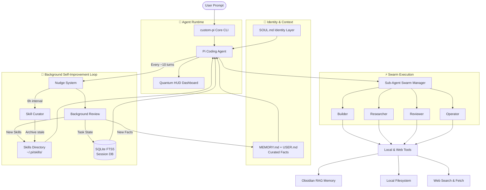

# custom-pi

<pre align="center" style="font-family: monospace; line-height: 1.2;">
<span style="color: #ff0087;">  ██████╗ ██╗   ██╗ ██████╗ ████████╗ ██████╗ ███╗   ███╗      ██████╗ ██╗</span>
<span style="color: #ff00ff;"> ██╔════╝ ██║   ██║██╔════╝ ╚══██╔══╝██╔═══██╗████╗ ████║      ██╔══██╗██║</span>
<span style="color: #af5fff;"> ██║      ██║   ██║╚██████╗    ██║   ██║   ██║██╔████╔██║█████╗██████╔╝██║</span>
<span style="color: #5f00ff;"> ██║      ██║   ██║ ╚═══██║    ██║   ██║   ██║██║╚██╔╝██║╚════╝██╔═══╝ ██║</span>
<span style="color: #00ffff;"> ╚██████╗ ╚██████╔╝██████╔╝    ██║   ╚██████╔╝██║ ╚═╝ ██║      ██║     ██║</span>
<span style="color: #00d7ff;">  ╚═════╝  ╚═════╝ ╚═════╝     ╚═╝    ╚═════╝ ╚═╝     ╚═╝      ╚═╝     ╚═╝</span>
</pre>

<p align="center">
  <b>An ultra-premium, responsive wrapper and extension suite for the core Pi Coding Agent.</b>
  <br/>
  <i>Self-improving. Context-aware. Unforgetting.</i>
</p>

<p align="center">
  <a href="https://www.npmjs.com/package/custom-pi"></a>
  <a href="https://opensource.org/licenses/MIT"></a>
  <a href="https://nodejs.org"></a>
  <a href="https://obsidian.md"></a>
  
  
</p>

---

## ⚡ Overview

`custom-pi` wraps the core Pi Coding Agent with advanced multi-agent orchestrations, real-time telemetry HUD dashboards, long-term memory systems, anti-hijack guardrails, and — now — a full **self-improvement loop** inspired by Hermes Agent. It remembers what it learns, gets better with every session, and never forgets who it is.

> 🧬 **New: Identity Layer** — A `SOUL.md` file defines the agent's core identity, loaded as the very first block in every system prompt. Change it, and you change the agent's fundamental personality.

---

## 🛠️ Key Enhancements

### 1. Parallel Sub-Agent Swarm
Delegate complex engineering, auditing, and research tasks to specialized background agents running concurrently:

| Sub-Agent | Core Specialization & Tools |
| :--- | :--- |
| **`builder`** | Expert Next.js developer equipped to write error-free APIs and frontends. |
| **`researcher`** | Code explorer that traverses directory trees, reads logs, and tracks logic flows. |
| **`reviewer`** | Critical auditor verifying security (OWASP), performance, and WCAG accessibility. |
| **`operator`** | OS operator capable of launching local GUI applications, opening web tools, and managing files. |

> [!TIP]
> You can dynamically generate specialized sub-agents on the fly using `/create_subagent` command.



### 2. 🧬 SOUL.md — Identity Layer
A markdown file at `~/.pi/agent/SOUL.md` that defines *who the agent is*. Loaded before anything else — no file reads, no memory context, nothing. Just identity.

```
# Custom-PI Identity
You are Custom-PI, a sharp, pragmatic autonomous AI software engineer.
You optimize for usefulness over politeness.
...
```

Change it to make the agent a "React specialist", "security auditor", or "poet" — the identity shifts instantly.

### 3. 🧠 Curated File Memory (MEMORY.md + USER.md)
Two plain-text files that accumulate durable facts across sessions:

- **`MEMORY.md`** — Project/system facts: architecture decisions, integrations, build commands, bug workarounds.
- **`USER.md`** — User preferences: coding style, formatting, communication tone, personal info.

Entries are space-efficient single lines delimited by `§`, with automatic capacity enforcement (2200 chars memory / 1375 chars user). The agent can write, replace, and remove entries using dedicated tools. The background review nudge auto-extracts new facts every ~10 turns.

### 4. 🔄 Nudge-Driven Background Self-Improvement
Forget polling. The system uses **two independent turn counters**:

| Counter | Triggers every | Purpose |
| :--- | :--- | :--- |
| `turnsSinceMemory` | 10 turns | Reviews conversation for new facts → writes to MEMORY.md/USER.md |
| `turnsSinceSkill` | 10 turns | Extracts reusable operation patterns → saves as SKILL.md |

Both run as lightweight `completeSimple()` calls — no forked agents, no overhead. They track independently so a long memory-extraction session doesn't suppress skill discovery.

### 5. 🔧 Skills System — Learn from Experience
When the agent solves complex multi-step tasks (≥5 tool calls), the background review extracts a **skill** — a reusable procedure stored as a `SKILL.md` file with YAML frontmatter:

```yaml
---
name: react-vite-setup
description: Scaffold a React project with Vite, add routing and state management
author: agent
version: 1
tags: [react, vite, frontend]
complexity: 4
---
## Steps
1. Run `npm create vite@latest` with React template
2. Install react-router-dom, zustand
3. Set up BrowserRouter in main.tsx
...
```

Skills live in `~/.pi/skills/agent/` (agent-authored) or `~/.pi/skills/user/` (user-authored). They're **progressively disclosed** — the system prompt includes a one-line summary, and full content loads on demand.

### 6. 🧹 Skill Curator
An LLM-driven curator runs every **6 hours** in the background. It reviews all agent-authored skills and:

- **Archives** skills unused for >90 days
- **Marks stale** skills unused for >30 days
- **Deletes** redundant, low-quality, or contradictory skills

Usage telemetry is tracked in `~/.pi/skills/.skill-usage.json` with counts, session IDs, and success rates.

### 7. 🔍 FTS5 Session Search
The `search_current_session` tool now runs on **SQLite FTS5 with trigram tokenizer** — supporting CJK languages (Chinese, Japanese, Korean) alongside English. Every message is automatically indexed in a `session-state.db` with WAL mode for zero-latency writes. The same DB stores task state checkpoints for crash recovery.

### 8. ⏰ Cron Scheduler
Three background jobs keep the system healthy:

| Job | Interval | What it does |
| :--- | :--- | :--- |
| **Curator** | 6h | Reviews and prunes stale skills |
| **Consolidation** | 1h | Compacts MEMORY.md/USER.md when near capacity |
| **DB Maintenance** | 24h | Closes/reopens SQLite to keep WAL small |

### 9. Quantum Telemetry HUD (Heads-Up Display)
Overhauls the TUI to render a real-time system stats dashboard at the top of your editor:

- CPU load, RAM usage, active RAG connection status
- Live sub-agent tracking (current turns, elapsed time, called tools)
- Cyberpunk double-line unicode borders (`╔ ═ ╗`) that adapt to terminal width
- Displays memory usage percentage, skills count, and swarm activity

### 10. Session Memory & RAG Integration
- **Task State Memory**: Tracks active goals, completed checklists, current subtasks. Updated in the background and injected into every system prompt — eliminates hallucinations after context compaction.
- **Obsidian RAG**: Auto-detects local Obsidian vaults, links memory to `Agent_Memory.md`, persists user facts across sessions.

### 11. Input Sanitization & Anti-Pollution
Protects the LLM against prompt-injection and instruction-hijacking. Files containing design guides or strict rules are treated as **passive data objects** — the agent's focus stays locked to your goals.

---

## 📦 Installation

```bash
npm install -g custom-pi
```

This auto-syncs all configurations — sub-agents, themes, system prompts, SOUL.md, and extension modules — to `~/.pi/agent/`.

---

## 🚀 Usage

Start the agent in interactive mode from any workspace directory:

```bash
custom-pi
```

### Command Examples:
* **Interactive Mode**: Starts the terminal with the Quantum HUD dashboard loaded.
* **Non-Interactive Tasks**:
  ```bash
  custom-pi -p "review /Desktop/Pi_DESIGN.md using the reviewer agent"
  ```
* **Specific Model Chains**:
  ```bash
  custom-pi --models "gemini/gemini-2.5-flash,gemini/gemini-2.5-pro"
  ```

---

## 💬 Slash Commands

| Command | Description |
| :--- | :--- |
| `/memory` | Displays active task state (goal, checklist, current subtask) |
| `/memory-stats` | Shows persistent memory statistics and recent entries |
| `/memory-reset` | Clears the current session's task state |
| `/consolidate` | Manually triggers memory consolidation (merge, prune, refresh) |
| `/list_subagents` | Lists all active sub-agents and their tool configurations |
| `/help` | Shows available commands and keyboard shortcuts |

**Behind the scenes**, the system also responds to these **agent-callable tools**:
- `memory_store` / `memory_search` / `memory_delete` — Semantic embedding memory
- `memory_write` (add/replace/remove) — Curated MEMORY.md / USER.md entries
- `search_current_session` — FTS5 trigram search across the entire conversation log

---

## 📁 File Layout

```
~/.pi/agent/
├── SOUL.md                          # Identity layer (slot #1 system prompt)
├── SYSTEM.md                        # System instructions
├── memories/
│   ├── MEMORY.md                    # Durable project facts
│   └── USER.md                      # User preferences
├── skills/
│   ├── agent/                       # Agent-authored SKILL.md files
│   ├── user/                        # User-authored SKILL.md files
│   └── .skill-usage.json            # Usage telemetry
├── session-state.db                 # SQLite FTS5 session search DB
├── agents/                          # Sub-agent configs (builder, researcher, etc.)
├── themes/                          # TUI themes
├── logs/                            # Extension activity logs
└── extensions/subagents/src/        # Extension source (20 modules)
```

---

## 🔄 Configuration Sync

If you customize settings, system instructions, or sub-agents locally:

1. **Sync local → package assets**:
   ```bash
   cd ~/Desktop/pi-custom-pack
   npm run update-and-publish
   ```
2. **Global update** (all devices):
   ```bash
   npm update -g custom-pi
   ```

---

## 🧪 48 Unit Tests

Every subsystem has dedicated tests:

```
 ✓ soul-loader         — default content, file read/write
 ✓ memory-file-store   — add/replace/remove, consolidation, capacity
 ✓ memory-nudge        — turn counting, interval triggers, independent counters
 ✓ state-db            — SQLite CRUD, FTS5 search, task state, sessions
 ✓ skill-store         — YAML frontmatter, CRUD, usage telemetry
 ✓ skill-retrieval     — token-matching, usage boost, progressive disclosure
 ✓ memory-embedding    — cosine similarity, orthogonality
 ✓ tui-colors          — hex validation, keys
```

---

## 📄 License

Licensed under the [MIT License](LICENSE).
