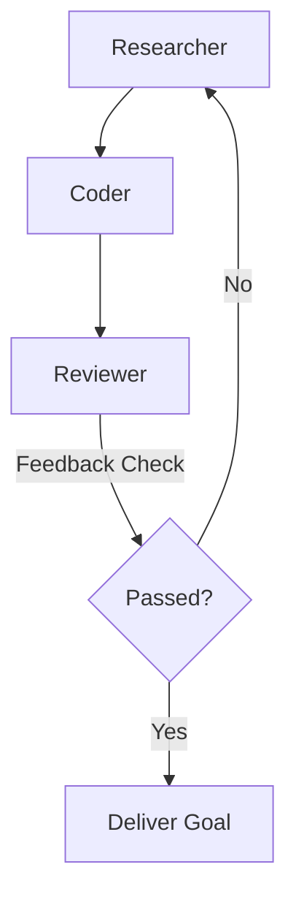

# ⛓️ DAG Swarm Orchestration

Single agents often run into logical dead-ends or loop indefinitely on complex debugging cycles. Custom-PI solves this by introducing a **Directed Acyclic Graph (DAG) Multi-Agent Swarm**. The swarm routes sub-tasks to specialized agents running concurrently.

## 👥 Swarm Roles

By default, the swarm is composed of three roles:
1. **Researcher**: Specialized in exploring directories, performing web searches, querying semantic memory, and analyzing specifications. Equipped with search and reading tools.
2. **Coder**: Focuses on implementing the actual solution, editing files, running compiler/linter tasks, and recovering from errors. Equipped with file writing, diff, and refactoring tools.
3. **Reviewer**: Evaluates the coder's deliverables, runs the test suite, validates type safety, and analyzes performance metrics. Equipped with shell execution, LSP, and ast-grep tools.

## 🔄 Execution Modes

Swarms are configured in `~/.pi/agent/dag-config.yaml` and support three modes:

### 1. Pipeline Mode
Executes agents sequentially according to their dependency tree. Once the end of the pipeline is reached, the **CEO Orchestrator** checks the deliverables. If there are failures, it generates feedback and routes it back to the Researcher/Coder for another iteration.

### 2. Parallel Mode
Agents run concurrently. This is useful for wide-scale codebase audits, parallel research, and running multiple testing tasks at the same time.

### 3. Sequential Mode
Forces a strict, single-lane execution pipeline where each agent runs only after its parent successfully terminates.

## 🛡️ Cycle Detection & Isolation
* **Cycle Prevention**: Built-in topological sorting using **Kahn's Algorithm** runs prior to execution to detect circular dependencies in `dag-config.yaml`.
* **Failure Isolation**: If a sub-agent fails a turn, its execution is paused, and the error is fed to the CEO Orchestrator. The remainder of the swarm is isolated from cascading crashes.